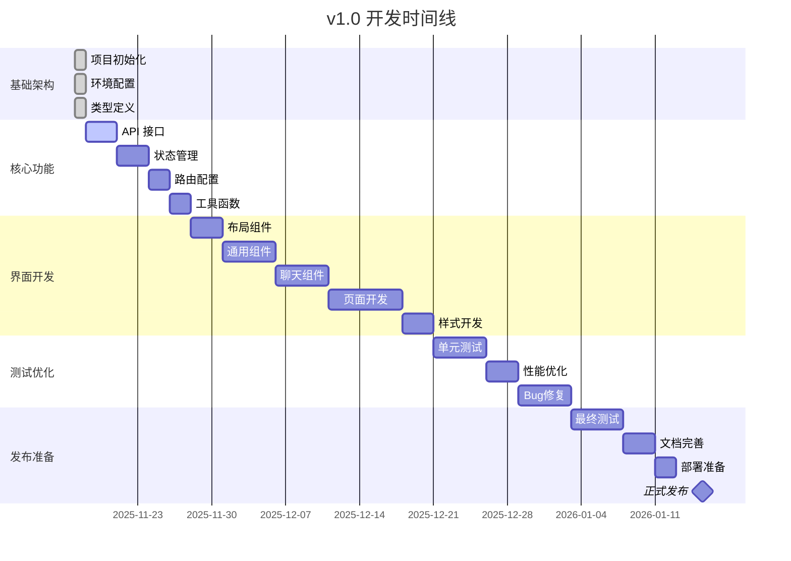

# Chatlog Session v1.0 开发状态

## 📊 项目概览

| 项目信息 | 内容 |
|---------|------|
| **项目名称** | Chatlog Session |
| **当前版本** | v1.0.0-dev |
| **开始日期** | 2025-11-17 |
| **目标发布** | 2026-01-15 |
| **开发进度** | 15% |
| **状态** | 开发中 🚧 |

---

## 🎯 v1.0 MVP 目标

### 核心功能
- ✅ 会话列表展示
- ✅ 基础消息浏览（文本）
- ✅ 联系人列表
- ✅ 简单搜索功能
- ✅ 基础设置

### 技术目标
- ✅ Vue 3 + TypeScript
- ✅ Vite 构建工具
- ✅ Pinia 状态管理
- ✅ Element Plus UI 组件库
- ✅ 响应式设计

---

## 📈 开发进度

### 阶段 1: 基础架构 ✅ (100%)

- [x] 项目初始化
  - [x] package.json 配置
  - [x] TypeScript 配置
  - [x] Vite 配置
  - [x] ESLint/Prettier 配置
  - [x] Git 配置

- [x] 环境配置
  - [x] 开发环境变量
  - [x] 生产环境变量
  - [x] API 代理配置

- [x] 类型定义
  - [x] 消息类型 (message.ts)
  - [x] 会话类型 (session.ts)
  - [x] 联系人类型 (contact.ts)
  - [x] API 类型 (api.ts)
  - [x] 应用类型 (index.ts)

- [x] 工具函数
  - [x] HTTP 请求封装 (request.ts)

- [x] 基础组件
  - [x] App.vue 根组件
  - [x] main.ts 入口文件

---

### 阶段 2: 核心功能 🚧 (0%)

#### API 接口层 (0/4)
- [ ] 聊天记录 API (`src/api/chatlog.ts`)
  - [ ] getChatlog - 获取聊天记录
  - [ ] searchMessages - 搜索消息
- [ ] 会话管理 API (`src/api/session.ts`)
  - [ ] getSessions - 获取会话列表
  - [ ] getSessionDetail - 获取会话详情
- [ ] 联系人 API (`src/api/contact.ts`)
  - [ ] getContacts - 获取联系人列表
  - [ ] getChatrooms - 获取群聊列表
  - [ ] getContactDetail - 获取联系人详情
- [ ] 多媒体 API (`src/api/media.ts`)
  - [ ] getImageUrl - 获取图片URL
  - [ ] getVideoUrl - 获取视频URL
  - [ ] getVoiceUrl - 获取语音URL

#### 状态管理 (0/4)
- [ ] App Store (`src/stores/app.ts`)
  - [ ] 应用配置
  - [ ] 主题切换
  - [ ] 加载状态
- [ ] Chat Store (`src/stores/chat.ts`)
  - [ ] 消息列表
  - [ ] 当前会话
  - [ ] 消息加载
  - [ ] 消息搜索
- [ ] Session Store (`src/stores/session.ts`)
  - [ ] 会话列表
  - [ ] 会话筛选
  - [ ] 会话排序
- [ ] Contact Store (`src/stores/contact.ts`)
  - [ ] 联系人列表
  - [ ] 群聊列表
  - [ ] 联系人搜索

#### 路由配置 (0/1)
- [ ] 路由设置 (`src/router/index.ts`)
  - [ ] 主页面路由
  - [ ] 聊天页面路由
  - [ ] 联系人页面路由
  - [ ] 设置页面路由

#### 工具函数 (1/5)
- [x] HTTP 请求 (`src/utils/request.ts`)
- [ ] 日期格式化 (`src/utils/date.ts`)
- [ ] 本地存储 (`src/utils/storage.ts`)
- [ ] 格式化工具 (`src/utils/format.ts`)
- [ ] 验证工具 (`src/utils/validator.ts`)

---

### 阶段 3: 界面开发 🔜 (0%)

#### 布局组件 (0/3)
- [ ] 主布局 (`src/layouts/DefaultLayout.vue`)
- [ ] 移动端布局 (`src/layouts/MobileLayout.vue`)
- [ ] 空布局 (`src/layouts/EmptyLayout.vue`)

#### 通用组件 (0/8)
- [ ] 侧边栏 (`src/components/common/Sidebar.vue`)
- [ ] 头像 (`src/components/common/Avatar.vue`)
- [ ] 搜索框 (`src/components/common/SearchBar.vue`)
- [ ] 加载状态 (`src/components/common/Loading.vue`)
- [ ] 空状态 (`src/components/common/Empty.vue`)
- [ ] 错误提示 (`src/components/common/Error.vue`)
- [ ] 确认对话框 (`src/components/common/Confirm.vue`)
- [ ] 时间显示 (`src/components/common/Time.vue`)

#### 聊天组件 (0/5)
- [ ] 会话列表 (`src/components/chat/SessionList.vue`)
- [ ] 会话项 (`src/components/chat/SessionItem.vue`)
- [ ] 消息列表 (`src/components/chat/MessageList.vue`)
- [ ] 消息气泡 (`src/components/chat/MessageBubble.vue`)
- [ ] 聊天头部 (`src/components/chat/ChatHeader.vue`)

#### 页面组件 (0/4)
- [ ] 聊天页面 (`src/views/Chat/index.vue`)
- [ ] 联系人页面 (`src/views/Contact/index.vue`)
- [ ] 搜索页面 (`src/views/Search/index.vue`)
- [ ] 设置页面 (`src/views/Settings/index.vue`)

#### 样式文件 (0/4)
- [ ] 全局样式 (`src/assets/styles/index.scss`)
- [ ] 变量定义 (`src/assets/styles/variables.scss`)
- [ ] 混入 (`src/assets/styles/mixins.scss`)
- [ ] 主题 (`src/assets/styles/themes.scss`)

---

### 阶段 4: 测试优化 🔜 (0%)

- [ ] 单元测试
  - [ ] 工具函数测试
  - [ ] Store 测试
  - [ ] 组件测试
- [ ] E2E 测试
  - [ ] 主流程测试
  - [ ] 边界情况测试
- [ ] 性能优化
  - [ ] 虚拟滚动
  - [ ] 懒加载
  - [ ] 代码分割
- [ ] Bug 修复
  - [ ] 功能 Bug
  - [ ] 样式问题
  - [ ] 兼容性问题

---

### 阶段 5: 文档完善 ✅ (100%)

- [x] 用户文档
  - [x] 用户使用手册
  - [x] 常见问题
  - [x] 快捷键参考
- [x] 开发文档
  - [x] 开发者指南
  - [x] 开发规范
  - [x] 贡献指南
- [x] 产品文档
  - [x] 产品设计文档
  - [x] 功能设计
  - [x] 界面设计规范
- [x] API 文档
  - [x] API 参考文档
  - [x] 接口说明
  - [x] 使用示例

---

## 📅 里程碑时间线



---

## 🎯 当前任务

### 本周任务 (2025-11-18 ~ 2025-11-24)

#### 优先级 P0
1. [ ] 完成 API 接口层封装
   - [ ] chatlog.ts - 聊天记录接口
   - [ ] session.ts - 会话管理接口
   - [ ] contact.ts - 联系人接口
2. [ ] 实现核心 Store
   - [ ] app.ts - 应用状态
   - [ ] chat.ts - 聊天状态
   - [ ] session.ts - 会话状态

#### 优先级 P1
3. [ ] 配置路由系统
4. [ ] 完善工具函数
   - [ ] date.ts - 日期处理
   - [ ] storage.ts - 本地存储
   - [ ] format.ts - 格式化

### 下周计划 (2025-11-25 ~ 2025-12-01)
- [ ] 开发主布局组件
- [ ] 实现侧边栏导航
- [ ] 开发会话列表组件
- [ ] 开始消息显示组件

---

## 🐛 已知问题

### Bug 列表
目前无已知 Bug（项目刚开始）

### 技术债务
- 无

---

## 📝 开发笔记

### 2025-11-17
- ✅ 项目初始化完成
- ✅ 基础架构搭建完成
- ✅ 所有配置文件创建完成
- ✅ 类型定义完成
- ✅ HTTP 请求封装完成
- ✅ 项目文档完成（用户手册、开发指南、产品设计、API文档）
- 📝 下一步：开始 API 接口层开发

### 技术决策
- **前端框架**: Vue 3 (Composition API)
  - 原因：现代化、TypeScript 友好、性能优秀
- **状态管理**: Pinia
  - 原因：轻量、类型安全、Vue 3 官方推荐
- **UI 框架**: Element Plus
  - 原因：组件丰富、文档完善、生态成熟
- **构建工具**: Vite
  - 原因：快速、现代、开发体验好
- **代码风格**: ESLint + Prettier
  - 原因：统一代码风格、提高代码质量

---

## 📊 代码统计

### 当前代码量
```
文件数量: 25+
代码行数: ~2000 行
类型定义: 5 个文件
工具函数: 1 个文件
组件: 2 个文件
```

### 预计最终代码量（v1.0）
```
文件数量: ~100 个
代码行数: ~10,000 行
组件数量: ~30 个
API 接口: ~15 个
```

---

## 👥 团队

### 角色分配
- **项目负责人**: Product Team
- **前端开发**: 待定
- **UI/UX 设计**: 待定
- **测试**: 待定
- **文档**: ✅ 已完成

---

## 🔗 相关链接

- [GitHub 仓库](https://github.com/Rupert333/chatlog-session)
- [Chatlog 后端](https://github.com/Rupert333/chatlog)
- [开发快速开始](./GETTING_STARTED.md)
- [产品设计文档](./docs/PRODUCT_DESIGN.md)
- [开发者指南](./docs/DEVELOPER_GUIDE.md)

---

## 📢 更新日志

### 2025-11-17
- 🎉 项目启动
- ✅ 完成基础架构搭建
- ✅ 完成所有配置文件
- ✅ 完成类型定义
- ✅ 完成项目文档
- 📝 准备开始核心功能开发

---

**最后更新**: 2025-11-17 15:30  
**更新人**: Development Team  
**下次更新**: 2025-11-24