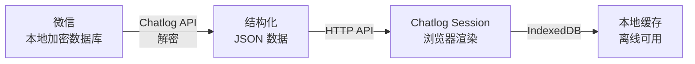
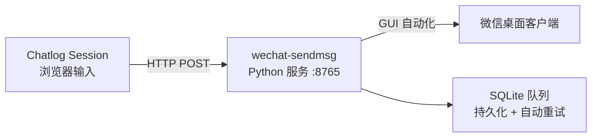
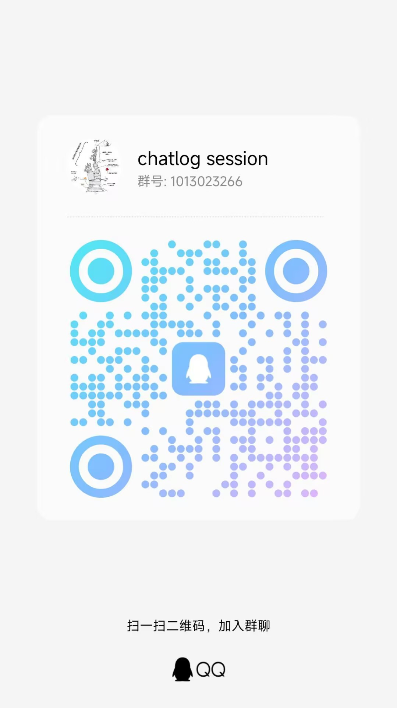

<div align="center">


# Chatlog Session

_基于 Chatlog API 的现代化微信聊天记录查看器_

[](LICENSE)
[](https://github.com/sjzar/chatlog)
[](https://vuejs.org/)
[](https://www.typescriptlang.org/)
[](https://web.dev/progressive-web-apps/)

**读 · 看 · 搜 · 发** — 一个前端，打通微信聊天记录的完整链路。

[快速开始](#-快速开始) ·
[功能特性](#-功能特性) ·
[界面预览](#-界面预览) ·
[更新日志](docs/changelog/) ·
[文档](docs/README.md)

</div>

---

## 这是什么？

Chatlog Session 是一个**纯前端的微信聊天记录浏览器**。它连接本地运行的 [Chatlog API](https://github.com/sjzar/chatlog)，把加密的微信数据库变成你熟悉的聊天界面——能看、能搜、能导出，还能直接回消息。



> **数据从不离开你的设备**。前端只在你浏览器里跑，后端只读你的本地数据库。没有云上传，没有第三方。

---

## ✨ 功能特性

### 消息浏览

- 🎨 **微信原生体验** — 深度复刻聊天界面，零学习成本
- ⚡ **十万级消息流畅** — 虚拟滚动 + LRU 缓存 + 智能分页
- 📂 **全消息类型** — 文本、图片、视频、语音、表情、文件、位置、名片、引用、转发、接龙、转账、红包、收藏、直播、小程序……
- 🖼️ **内置预览器** — 图片缩放/轮播、视频队列播放、Live Photo 支持
- 📱 **PWA 离线安装** — 装到桌面就是 App，离线也能翻已缓存的消息

### 搜索与导出

- 🔍 **全文搜索** — 搜索联系人、群聊、消息内容，支持拼音
- 📊 **数据仪表盘** — 聊天频次、消息类型分布、活跃时段统计
- 📤 **多格式导出** — JSON / CSV / TXT / Markdown / 剪贴板

### 消息发送

- 💬 **聊天框直接发送** — 看消息和发消息在同一个界面
- 📎 **图片 / 文件** — 支持粘贴、拖拽、选择文件
- 😀 **表情选择器** — 内置常用表情
- ⌨️ **自定义快捷键** — Enter 或 Ctrl+Enter 发送

<details>
<summary>📡 消息发送的工作原理</summary>



发送功能依赖 [wechat-sendmsg](https://github.com/xlight/wechat-sendmsg)（需额外安装），通过 GUI 自动化操作微信客户端完成发送。消息经 SQLite 队列持久化，失败自动重试。

> ⚠️ 发送功能**默认关闭**。配置路径：**设置 → 发送设置**。需微信桌面客户端保持登录状态。

</details>

---

## 📸 界面预览

<div align="center">
  <table>
    <tr>
      <td></td>
      <td></td>
    </tr>
    <tr><td align="center"><b>会话列表</b></td><td align="center"><b>联系人列表</b></td></tr>
  </table>
  <br>
  
  <p><b>数据仪表盘</b></p>
  <br>
  
  <p><b>全局搜索</b></p>
</div>

---

## 🚀 快速开始

### 前置依赖

Chatlog Session 是纯前端，但工作需要后端：

| 组件 | 说明 | 必要性 |
|------|------|:--:|
| [Chatlog API](https://github.com/sjzar/chatlog) | 聊天记录读取 & 解密服务 (Golang) | **必须** |
| [wechat-sendmsg](https://github.com/xlight/wechat-sendmsg) | 消息发送服务 (Python) | 发送时必需 |
| 微信桌面客户端 | wechat-sendmsg 需要微信保持登录 | 发送时必需 |

### 方式一：使用 GitHub Pages 部署

👉 **[https://xlight.github.io/chatlog-session/](https://xlight.github.io/chatlog-session/)**

1. 打开上方链接
2. 进入 **设置 → API 设定**，填入 Chatlog API 地址（如 `http://localhost:5030`）
3. 点击 **测试连接** 确认连通

> ⚠️ 在线页面是 HTTPS，连接本地 HTTP API 可能被浏览器拦截。用 Chrome 并允许不安全内容，或把 API 部署为 HTTPS。

### 方式二：本地运行

```bash
git clone https://github.com/xlight/chatlog-session.git
cd chatlog-session

corepack enable        # 启用 pnpm
pnpm install          # 安装依赖
pnpm dev              # 启动 → http://localhost:5173
```

---

## 🛠️ 技术栈

| 层 | 技术 |
|---|---|
| **框架** | Vue 3 · TypeScript 6 · Vite 8 |
| **状态** | Pinia 3 · Pinia PersistedState |
| **UI** | Element Plus · vue-virtual-scroller |
| **工具库** | dayjs · marked · pinyin-pro · DOMPurify · VueUse |
| **存储** | IndexedDB (idb) · SessionStorage LRU 缓存 |
| **后端依赖** | [Chatlog API](https://github.com/sjzar/chatlog) · [wechat-sendmsg](https://github.com/xlight/wechat-sendmsg) |
| **测试** | Vitest 4 · @vue/test-utils · jsdom · 覆盖率 V8 |

---

## 🗺️ 路线图

上一时间线的大致规划，具体工作随需求调整。

### 近期

- [x] **v0.28.0** — 视频预览、导出剪贴板、表情选择器、发送快捷键
- [ ] **下一版本** — 导出体验升级、失败重试、断点续导

### 远期

- [ ] **v1.0.0** — 正式版发布

> 历史版本详见 [docs/changelog/](docs/changelog/)。完整规划见 [ROADMAP.md](https://github.com/xlight/chatlog-session-docs/blob/main/ROADMAP.md)。

---

## ❓ 常见问题

<details>
<summary><b>为什么我的图片/视频显示不出来？</b></summary>

1. 确认 Chatlog API 服务正常运行，且正确返回 `img_key`
2. 视频/图片可能需要先在 PC 微信客户端中点击查看，触发下载到本地
3. HTTPS 页面连 HTTP API 会被浏览器拦截（Mixed Content），用 Chrome 并允许不安全内容

</details>

<details>
<summary><b>数据存在哪里？安全吗？</b></summary>

所有聊天数据只在你的浏览器 IndexedDB 中缓存。后端 Chatlog API **只读**你的本地数据库。没有任何数据上传到云端。

</details>

<details>
<summary><b>支持哪些版本的微信？</b></summary>

Chatlog Session 本身不限制版本。具体微信版本兼容性由后端 [Chatlog](https://github.com/sjzar/chatlog) 决定，请查看其文档。

</details>

更多问题见 [docs/faq.md](docs/faq.md)。

---

## 📄 许可证

[Apache License 2.0](LICENSE)

## 🙏 致谢

- [Chatlog](https://github.com/sjzar/chatlog) — 聊天记录读取 & 解密引擎
- [Vue.js](https://vuejs.org/) · [Vite](https://vitejs.dev/) · [Element Plus](https://element-plus.org/)

## 📞 交流

- 🐛 [GitHub Issues](https://github.com/xlight/chatlog-session/issues) — Bug 反馈 & 功能建议
- 📖 [项目文档](docs/README.md) — 完整文档索引（321 篇）
- 🐧 **QQ 交流群：1013023266**

<div align="center">
  
</div>

---

<div align="center">

[](https://star-history.com/#xlight/chatlog-session&Date)

**Built with ❤️ by Chatlog Session Team**

</div>
