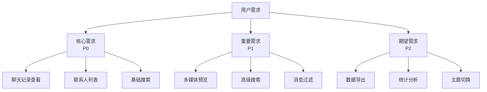
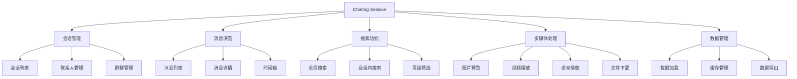
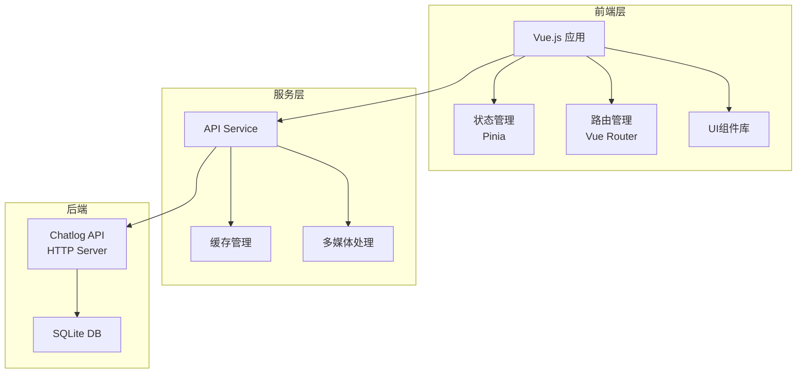
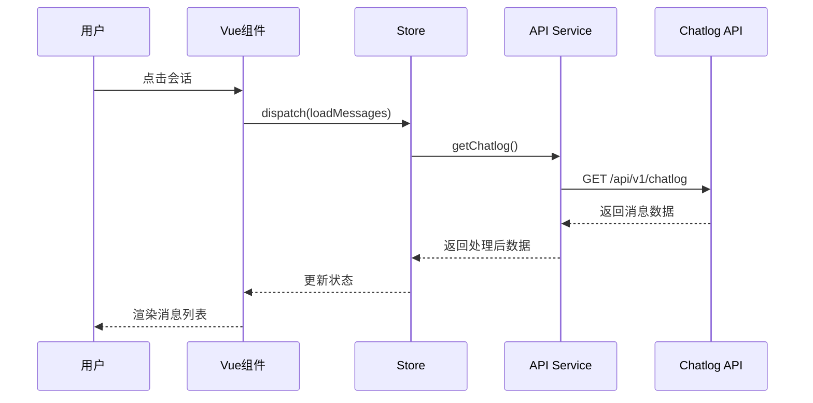
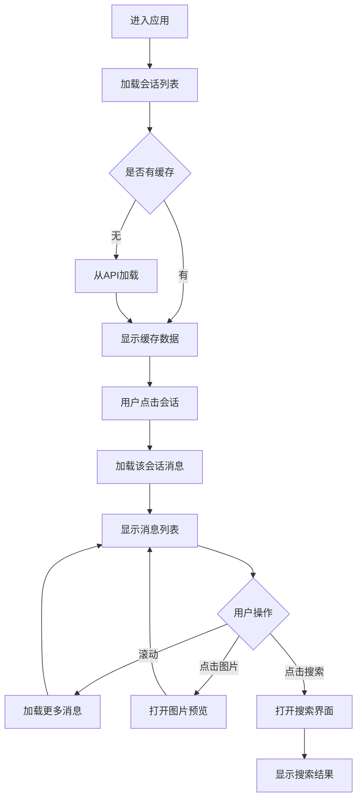
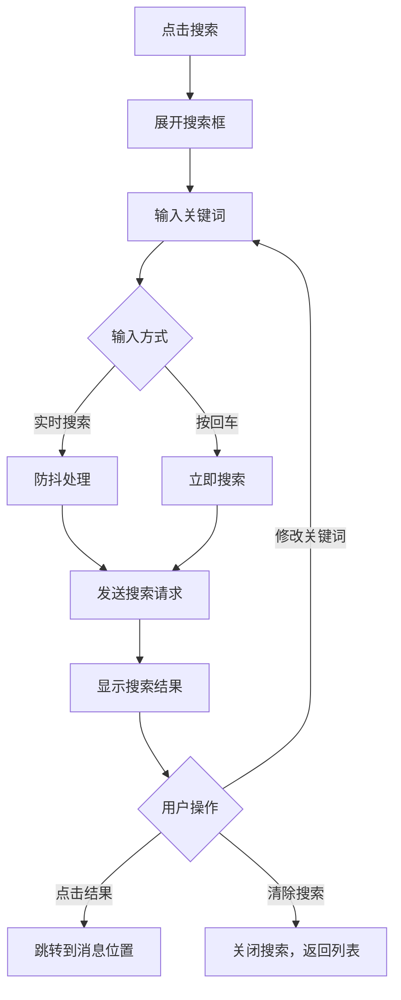
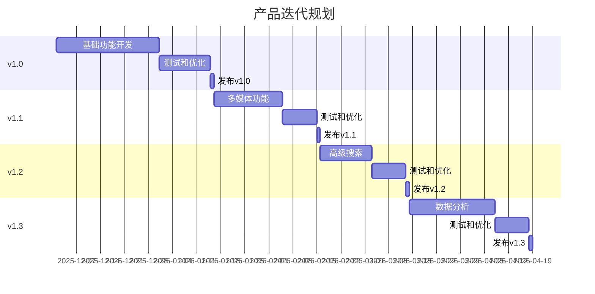

# Chatlog Session 产品设计文档

## 文档信息

| 项目 | 内容 |
|------|------|
| **文档版本** | v1.0.0 |
| **创建日期** | 2025-11 |
| **产品名称** | Chatlog Session |
| **文档状态** | Draft |
| **负责人** | Product Team |

## 目录

- [1. 产品概述](#1-产品概述)
- [2. 用户分析](#2-用户分析)
- [3. 功能设计](#3-功能设计)
- [4. 界面设计](#4-界面设计)
- [5. 技术架构](#5-技术架构)
- [6. 数据流设计](#6-数据流设计)
- [7. 交互设计](#7-交互设计)
- [8. 性能指标](#8-性能指标)
- [9. 安全设计](#9-安全设计)
- [10. 迭代规划](#10-迭代规划)

---

## 1. 产品概述

### 1.1 产品定位

Chatlog Session 是一个基于 Web 的微信聊天记录查看器，旨在为用户提供一个熟悉、易用的界面来浏览和管理本地微信聊天记录。

### 1.2 核心价值

- **隐私保护**: 所有数据在本地处理，不上传到云端
- **高效查找**: 快速检索历史聊天记录
- **熟悉体验**: 类微信界面设计，零学习成本
- **多媒体支持**: 完整展示图片、视频、语音等内容

### 1.3 产品目标

| 目标类型 | 具体目标 |
|---------|---------|
| **短期目标** | 完成基础聊天记录查看功能，支持 1000+ 用户使用 |
| **中期目标** | 实现高级搜索、数据分析等功能，用户满意度 > 85% |
| **长期目标** | 成为微信聊天记录管理的首选工具 |

### 1.4 使用场景

1. **个人回顾**: 查找重要的历史聊天记录
2. **数据备份**: 浏览和管理备份的聊天数据
3. **信息检索**: 快速定位特定时间段或关键词的对话
4. **多媒体查看**: 查看历史图片、视频等多媒体内容

---

## 2. 用户分析

### 2.1 目标用户

#### 主要用户群体

| 用户类型 | 占比 | 特征 | 需求 |
|---------|------|------|------|
| **职场人士** | 40% | 25-40岁，需要查找工作相关聊天记录 | 高效搜索、快速定位 |
| **普通用户** | 35% | 18-50岁，查看个人聊天历史 | 简单易用、多媒体查看 |
| **技术爱好者** | 15% | 20-35岁，对数据管理感兴趣 | 高级功能、数据导出 |
| **企业用户** | 10% | 需要管理团队聊天记录 | 批量处理、权限管理 |

### 2.2 用户画像

#### 画像 1: 职场白领 - 张经理

- **年龄**: 32岁
- **职业**: 项目经理
- **使用场景**: 经常需要查找与客户的历史沟通记录
- **痛点**: 微信搜索功能有限，难以精确定位
- **期望**: 能够按时间、关键词快速检索，支持导出重要对话

#### 画像 2: 普通用户 - 李同学

- **年龄**: 22岁
- **职业**: 大学生
- **使用场景**: 查看与朋友的聊天回忆
- **痛点**: 想保存重要的聊天记录和照片
- **期望**: 界面友好，能够查看历史照片和视频

#### 画像 3: 技术爱好者 - 王工程师

- **年龄**: 28岁
- **职业**: 软件工程师
- **使用场景**: 数据备份和管理
- **痛点**: 希望完全掌控自己的数据
- **期望**: 支持数据导出、API 访问、自定义功能

### 2.3 用户需求优先级



---

## 3. 功能设计

### 3.1 功能架构



### 3.2 核心功能详细设计

#### 3.2.1 会话列表

**功能描述**: 展示所有聊天会话，包括私聊和群聊

**功能要点**:
- 显示最近联系人/群组
- 展示最后一条消息预览
- 显示未读消息数量（如适用）
- 支持置顶功能
- 支持搜索联系人

**数据来源**: `GET /api/v1/session`

**界面元素**:
```
┌─────────────────────────────────┐
│  🔍 搜索联系人                    │
├─────────────────────────────────┤
│  📌 张三                          │
│     [文本] 明天见                 │
│     12:30                        │
├─────────────────────────────────┤
│  👥 项目组                        │
│     [图片]                       │
│     昨天                         │
├─────────────────────────────────┤
│  李四                            │
│     好的，收到                    │
│     周一                         │
└─────────────────────────────────┘
```

#### 3.2.2 消息浏览

**功能描述**: 查看特定会话的完整聊天记录

**功能要点**:
- 按时间顺序显示消息
- 区分发送者和接收者
- 支持多种消息类型（文本、图片、视频、语音、文件等）
- 显示消息时间戳
- 支持消息加载更多（分页）
- 支持跳转到特定日期

**数据来源**: `GET /api/v1/chatlog?talker={id}&time={range}`

**消息类型支持**:

| 类型 | 展示方式 | 交互 |
|------|---------|------|
| 文本 | 直接显示 | 可选中、复制 |
| 图片 | 缩略图 | 点击放大预览 |
| 视频 | 封面+播放按钮 | 点击播放 |
| 语音 | 语音条+时长 | 点击播放 |
| 文件 | 文件图标+名称 | 点击下载 |
| 链接 | 卡片样式 | 点击跳转 |
| 位置 | 地图缩略图 | 点击查看详情 |

#### 3.2.3 搜索功能

**功能描述**: 在聊天记录中搜索特定内容

**搜索类型**:

1. **全局搜索**
   - 搜索所有会话中的消息
   - 按相关度排序结果
   - 显示搜索结果上下文

2. **会话内搜索**
   - 搜索当前会话的消息
   - 高亮显示匹配内容
   - 支持上一个/下一个导航

3. **高级筛选**
   - 按时间范围筛选
   - 按消息类型筛选
   - 按发送者筛选

**搜索参数**:
```
{
  "keyword": "关键词",
  "talker": "会话ID",
  "time": "2024-01-01~2024-12-31",
  "type": "text|image|video|voice",
  "sender": "发送者ID"
}
```

#### 3.2.4 多媒体处理

**图片预览**:
- 点击图片全屏预览
- 支持缩放、旋转
- 支持左右切换查看同会话其他图片
- 支持下载原图

**视频播放**:
- 内嵌视频播放器
- 支持播放控制（播放/暂停、进度、音量）
- 支持全屏播放
- 显示视频信息（时长、大小）

**语音播放**:
- 点击播放语音
- 显示播放进度
- 自动转换格式（SILK -> MP3）

#### 3.2.5 联系人管理

**功能描述**: 查看和管理联系人信息

**功能要点**:
- 显示联系人列表
- 查看联系人详细信息
- 支持按字母排序
- 支持搜索联系人
- 显示联系人头像、昵称、备注

**数据来源**: 
- `GET /api/v1/contact` - 联系人列表
- `GET /api/v1/chatroom` - 群聊列表

### 3.3 功能优先级

| 优先级 | 功能模块 | 版本 | 预计工作量 |
|--------|---------|------|-----------|
| P0 | 会话列表 | v1.0 | 3天 |
| P0 | 消息浏览（文本） | v1.0 | 5天 |
| P0 | 基础搜索 | v1.0 | 3天 |
| P1 | 图片预览 | v1.1 | 4天 |
| P1 | 视频播放 | v1.1 | 4天 |
| P1 | 语音播放 | v1.1 | 3天 |
| P1 | 高级搜索 | v1.2 | 5天 |
| P2 | 数据导出 | v1.3 | 4天 |
| P2 | 统计分析 | v1.3 | 6天 |
| P2 | 主题切换 | v1.4 | 3天 |

---

## 4. 界面设计

### 4.1 整体布局

采用经典的三栏布局，模仿微信桌面端设计：

```
┌─────────┬──────────────┬────────────────────────┐
│         │              │                        │
│  侧边栏  │   会话列表    │      消息显示区         │
│         │              │                        │
│  [图标]  │  🔍 搜索      │  ← 张三                │
│         │  ─────────   │  ─────────────────────│
│  💬会话  │  📌 张三      │  [对方消息气泡]         │
│         │     明天见    │                        │
│  👤联系人│     12:30    │  [我的消息气泡]    ✓✓ │
│         │  ───────────│                        │
│  ⭐收藏   │  👥 项目组   │  [对方消息气泡]         │
│         │     [图片]   │                        │
│  ⚙️设置   │     昨天     │  ─────────────────────│
│         │  ───────────│  [输入框区域]  [emoji]  │
│         │  李四        │  [附件] [图片] [发送]   │
│         │     好的     │                        │
└─────────┴──────────────┴────────────────────────┘
   60px      280px            剩余空间
```

### 4.2 设计规范

#### 4.2.1 色彩方案

**亮色主题**:
```
主色调: #07C160 (微信绿)
背景色: #F7F7F7 (浅灰)
卡片背景: #FFFFFF (白色)
文字主色: #191919 (深灰)
文字副色: #999999 (中灰)
边框颜色: #E5E5E5 (浅灰)
消息气泡-自己: #95EC69 (浅绿)
消息气泡-对方: #FFFFFF (白色)
```

**暗色主题** (可选):
```
主色调: #07C160 (微信绿)
背景色: #1E1E1E (深灰)
卡片背景: #2B2B2B (暗灰)
文字主色: #E5E5E5 (浅灰)
文字副色: #999999 (中灰)
边框颜色: #3E3E3E (暗灰)
消息气泡-自己: #2D6A4F (深绿)
消息气泡-对方: #2B2B2B (暗灰)
```

#### 4.2.2 字体规范

```
标题大: 18px / Bold / Line-height: 24px
标题中: 16px / Bold / Line-height: 22px
标题小: 14px / Medium / Line-height: 20px
正文: 14px / Regular / Line-height: 20px
辅助文字: 12px / Regular / Line-height: 18px
时间戳: 11px / Regular / Line-height: 16px
```

#### 4.2.3 间距规范

```
页面边距: 16px
卡片间距: 8px
组件内边距: 12px
小间距: 4px
中间距: 8px
大间距: 16px
```

#### 4.2.4 圆角规范

```
按钮圆角: 4px
卡片圆角: 8px
消息气泡: 8px
头像圆角: 4px
输入框圆角: 4px
```

### 4.3 关键界面设计

#### 4.3.1 会话列表项

```
┌─────────────────────────────────────────┐
│  [头像] 张三                       12:30 │
│  48x48  明天见面详细讨论一下项目方案      │
│         ─────────────────────────────   │
└─────────────────────────────────────────┘
```

组成元素:
- 头像: 48x48px，圆角4px
- 昵称: 14px，加粗，最多显示12个字符
- 时间: 11px，灰色，右对齐
- 消息预览: 14px，常规，最多显示2行，超出省略

#### 4.3.2 消息气泡

**对方消息**:
```
┌────────────────────────────────┐
│  [头像]  ┌──────────────────┐  │
│   32x32  │ 消息内容          │  │
│          │ 可以多行显示      │  │
│          └──────────────────┘  │
│          10:30                  │
└────────────────────────────────┘
```

**自己的消息**:
```
┌────────────────────────────────┐
│        ┌──────────────────┐  [头像]│
│        │ 消息内容          │   32x32│
│        │ 可以多行显示      │        │
│        └──────────────────┘        │
│                      10:31  ✓✓    │
└────────────────────────────────────┘
```

#### 4.3.3 图片消息

```
┌────────────────────────────────┐
│  [头像]  ┌──────────────────┐  │
│   32x32  │                  │  │
│          │   [图片缩略图]    │  │
│          │   200x200 (max)  │  │
│          │                  │  │
│          └──────────────────┘  │
│          10:32                  │
└────────────────────────────────┘
```

点击后打开全屏预览:
```
┌────────────────────────────────────────┐
│  [X] 1/5                          [↓]  │
│                                        │
│                                        │
│            [完整图片显示]               │
│                                        │
│                                        │
│  [<]                              [>]  │
└────────────────────────────────────────┘
```

#### 4.3.4 语音消息

```
┌────────────────────────────────┐
│  [头像]  ┌──────────────────┐  │
│   32x32  │ ▶  ||||||||  3"  │  │
│          └──────────────────┘  │
│          10:33                  │
└────────────────────────────────┘
```

播放时:
```
┌────────────────────────────────┐
│  [头像]  ┌──────────────────┐  │
│   32x32  │ ⏸  ||||||||  1"  │  │
│          └──────────────────┘  │
│          10:33                  │
└────────────────────────────────┘
```

### 4.4 响应式设计

#### 4.4.1 断点定义

```
手机: < 768px
平板: 768px - 1024px
桌面: > 1024px
```

#### 4.4.2 适配方案

**桌面端** (> 1024px):
- 显示完整的三栏布局
- 侧边栏 60px + 会话列表 280px + 消息区域自适应

**平板端** (768px - 1024px):
- 隐藏侧边栏，功能整合到顶部
- 会话列表 240px + 消息区域自适应
- 点击菜单图标展开功能列表

**手机端** (< 768px):
- 单页面切换模式
- 会话列表占满屏幕
- 点击会话进入消息详情页
- 顶部显示返回按钮

---

## 5. 技术架构

### 5.1 架构图



### 5.2 技术选型

#### 5.2.1 核心技术栈

| 技术 | 版本 | 用途 | 理由 |
|------|------|------|------|
| Vue.js | 3.x | 前端框架 | 组件化、响应式、生态完善 |
| TypeScript | 5.x | 开发语言 | 类型安全、代码提示 |
| Vite | 4.x | 构建工具 | 快速开发、HMR |
| Pinia | 2.x | 状态管理 | 轻量、类型友好 |
| Vue Router | 4.x | 路由管理 | 官方路由方案 |
| Axios | 1.x | HTTP客户端 | 请求拦截、错误处理 |

#### 5.2.2 UI 相关

| 技术 | 版本 | 用途 |
|------|------|------|
| Element Plus | 2.x | UI组件库 |
| Tailwind CSS | 3.x | 样式工具 |
| VueUse | 10.x | 组合式函数库 |

#### 5.2.3 多媒体处理

| 技术 | 用途 |
|------|------|
| Plyr | 视频播放器 |
| Viewer.js | 图片预览 |
| Howler.js | 音频播放 |

### 5.3 项目结构

```
chatlog-session/
├── public/                 # 静态资源
│   ├── favicon.ico
│   └── index.html
├── src/
│   ├── api/               # API接口
│   │   ├── chatlog.ts     # 聊天记录API
│   │   ├── contact.ts     # 联系人API
│   │   └── session.ts     # 会话API
│   ├── assets/            # 资源文件
│   │   ├── images/
│   │   └── styles/
│   ├── components/        # 通用组件
│   │   ├── MessageBubble/ # 消息气泡
│   │   ├── MediaViewer/   # 多媒体查看器
│   │   └── SearchBar/     # 搜索栏
│   ├── composables/       # 组合式函数
│   │   ├── useChat.ts
│   │   ├── useMedia.ts
│   │   └── useSearch.ts
│   ├── layouts/           # 布局组件
│   │   ├── DefaultLayout.vue
│   │   └── MobileLayout.vue
│   ├── router/            # 路由配置
│   │   └── index.ts
│   ├── stores/            # 状态管理
│   │   ├── chat.ts
│   │   ├── contact.ts
│   │   └── user.ts
│   ├── types/             # 类型定义
│   │   ├── chat.ts
│   │   ├── message.ts
│   │   └── user.ts
│   ├── utils/             # 工具函数
│   │   ├── format.ts
│   │   ├── request.ts
│   │   └── storage.ts
│   ├── views/             # 页面组件
│   │   ├── Chat/          # 聊天页面
│   │   ├── Contact/       # 联系人页面
│   │   └── Settings/      # 设置页面
│   ├── App.vue            # 根组件
│   └── main.ts            # 入口文件
├── tests/                 # 测试文件
├── .env.development       # 开发环境变量
├── .env.production        # 生产环境变量
├── .eslintrc.js           # ESLint配置
├── .gitignore
├── package.json
├── tsconfig.json          # TypeScript配置
├── vite.config.ts         # Vite配置
└── README.md
```

### 5.4 核心模块设计

#### 5.4.1 API Service

```typescript
// src/api/chatlog.ts
interface ChatlogParams {
  time?: string;
  talker?: string;
  limit?: number;
  offset?: number;
  format?: 'json' | 'csv' | 'text';
}

interface Message {
  seq: number;
  time: string;
  talker: string;
  sender: string;
  type: number;
  subType: number;
  content: string;
  isSelf: boolean;
}

export const getChatlog = (params: ChatlogParams): Promise<Message[]> => {
  return request.get('/api/v1/chatlog', { params });
};
```

#### 5.4.2 状态管理

```typescript
// src/stores/chat.ts
import { defineStore } from 'pinia';

export const useChatStore = defineStore('chat', {
  state: () => ({
    currentSession: null,
    messages: [],
    sessions: [],
    loading: false,
  }),
  
  actions: {
    async loadMessages(talker: string, time?: string) {
      this.loading = true;
      try {
        const messages = await getChatlog({ talker, time });
        this.messages = messages;
      } finally {
        this.loading = false;
      }
    },
    
    async loadSessions() {
      const sessions = await getSessions();
      this.sessions = sessions;
    },
  },
});
```

#### 5.4.3 缓存策略

**LocalStorage 缓存**:
- 会话列表
- 联系人信息
- 用户设置

**SessionStorage 缓存**:
- 当前会话消息
- 搜索历史

**内存缓存**:
- 图片缩略图
- 最近访问的会话

---

## 6. 数据流设计

### 6.1 数据流图



### 6.2 API 接口设计

#### 6.2.1 获取聊天记录

**请求**:
```
GET /api/v1/chatlog?talker=wxid_123&time=2024-01-01~2024-12-31&limit=50&offset=0
```

**响应**:
```json
{
  "code": 0,
  "message": "success",
  "data": {
    "total": 1250,
    "messages": [
      {
        "seq": 1234567890000,
        "time": "2024-01-15T10:30:00+08:00",
        "talker": "wxid_123",
        "talkerName": "张三",
        "sender": "wxid_123",
        "senderName": "张三",
        "isSelf": false,
        "type": 1,
        "subType": 0,
        "content": "明天见",
        "imageUrl": null,
        "videoUrl": null,
        "voiceUrl": null
      }
    ]
  }
}
```

#### 6.2.2 获取会话列表

**请求**:
```
GET /api/v1/session
```

**响应**:
```json
{
  "code": 0,
  "message": "success",
  "data": [
    {
      "talker": "wxid_123",
      "talkerName": "张三",
      "avatar": "/image/avatar_123",
      "lastMessage": "明天见",
      "lastTime": "2024-01-15T10:30:00+08:00",
      "unreadCount": 0,
      "isPinned": false,
      "isChatRoom": false
    }
  ]
}
```

#### 6.2.3 获取多媒体内容

**图片**:
```
GET /image/{id}
Response: 302 Redirect 或直接返回图片
```

**视频**:
```
GET /video/{id}
Response: 302 Redirect 或直接返回视频
```

**语音**:
```
GET /voice/{id}
Response: MP3音频流
```

### 6.3 错误处理

#### 6.3.1 HTTP状态码

| 状态码 | 含义 | 处理方式 |
|--------|------|---------|
| 200 | 成功 | 正常处理 |
| 400 | 请求参数错误 | 提示用户，记录日志 |
| 401 | 未授权 | 跳转登录页 |
| 404 | 资源不存在 | 提示用户 |
| 500 | 服务器错误 | 提示用户，重试 |
| 503 | 服务不可用 | 提示用户，稍后重试 |

#### 6.3.2 错误信息展示

```typescript
interface ErrorHandler {
  showError(message: string, type: 'error' | 'warning'): void;
  logError(error: Error): void;
}

// 使用示例
try {
  const messages = await getChatlog(params);
} catch (error) {
  if (error.response?.status === 404) {
    showError('聊天记录不存在', 'warning');
  } else {
    showError('加载失败，请重试', 'error');
    logError(error);
  }
}
```

---

## 7. 交互设计

### 7.1 交互流程

#### 7.1.1 查看聊天记录流程



#### 7.1.2 搜索流程



### 7.2 动画设计

#### 7.2.1 页面切换动画

```css
/* 淡入淡出 */
.fade-enter-active, .fade-leave-active {
  transition: opacity 0.3s ease;
}
.fade-enter-from, .fade-leave-to {
  opacity: 0;
}

/* 滑动 */
.slide-enter-active, .slide-leave-active {
  transition: transform 0.3s ease;
}
.slide-enter-from {
  transform: translateX(100%);
}
.slide-leave-to {
  transform: translateX(-100%);
}
```

#### 7.2.2 消息加载动画

- 骨架屏 (Skeleton Screen)
- 加载指示器
- 平滑滚动

#### 7.2.3 交互反馈

| 交互 | 反馈 | 时机 |
|------|------|------|
| 点击会话 | 背景变色 | 立即 |
| 发送消息 | 加载动画 | 发送中 |
| 图片加载 | 占位符+进度 | 加载中 |
| 错误提示 | Toast消息 | 错误发生 |

### 7.3 手势支持

**移动端手势**:
- 下拉刷新: 在消息列表顶部下拉
- 上拉加载: 在消息列表底部上拉
- 左滑删除: 在会话列表项上左滑（可选）
- 双指缩放: 图片预览时缩放
- 长按: 显示消息操作菜单

### 7.4 无障碍设计

- 合理的语义化 HTML 标签
- ARIA 属性支持
- 键盘导航支持
- 颜色对比度符合 WCAG 标准
- 屏幕阅读器友好

---

## 8. 性能指标

### 8.1 性能目标

| 指标 | 目标值 | 测量方式 |
|------|--------|---------|
| 首屏加载时间 | < 2s | Lighthouse |
| 会话列表加载 | < 500ms | Performance API |
| 消息列表加载 | < 1s | Performance API |
| 图片预览打开 | < 300ms | Performance API |
| 搜索响应时间 | < 500ms | Performance API |
| 页面切换 | < 200ms | Performance API |

### 8.2 性能优化策略

#### 8.2.1 加载优化

**懒加载**:
- 图片懒加载
- 路由懒加载
- 组件懒加载

**预加载**:
- 预加载关键资源
- DNS 预解析
- 资源预连接

**代码分割**:
```typescript
// 路由懒加载
const Chat = () => import('./views/Chat/index.vue');
const Contact = () => import('./views/Contact/index.vue');

// 组件懒加载
const MediaViewer = defineAsyncComponent(() => 
  import('./components/MediaViewer.vue')
);
```

#### 8.2.2 渲染优化

**虚拟滚动**:
```vue
<template>
  <RecycleScroller
    :items="messages"
    :item-size="80"
    key-field="seq"
  >
    <template #default="{ item }">
      <MessageItem :message="item" />
    </template>
  </RecycleScroller>
</template>
```

**防抖节流**:
```typescript
import { useDebounceFn, useThrottleFn } from '@vueuse/core';

// 搜索防抖
const debouncedSearch = useDebounceFn((keyword) => {
  search(keyword);
}, 300);

// 滚动节流
const throttledScroll = useThrottleFn(() => {
  loadMore();
}, 200);
```

#### 8.2.3 缓存策略

**Service Worker**:
- 缓存静态资源
- 离线访问支持

**HTTP 缓存**:
- 设置合理的 Cache-Control
- ETag 支持

**应用缓存**:
- LocalStorage: 持久化数据
- SessionStorage: 会话数据
- IndexedDB: 大量数据存储

#### 8.2.4 网络优化

**请求优化**:
- 请求合并
- 请求取消（避免重复请求）
- 并行请求

**数据压缩**:
- Gzip/Brotli 压缩
- 图片压缩
- 资源压缩

### 8.3 监控指标

```typescript
// 性能监控
interface PerformanceMetrics {
  FCP: number;  // First Contentful Paint
  LCP: number;  // Largest Contentful Paint
  FID: number;  // First Input Delay
  CLS: number;  // Cumulative Layout Shift
  TTFB: number; // Time to First Byte
}

// 上报性能数据
function reportMetrics(metrics: PerformanceMetrics) {
  // 发送到分析平台
  analytics.track('performance', metrics);
}
```

---

## 9. 安全设计

### 9.1 安全原则

- **最小权限原则**: 只请求必要的数据
- **数据隔离**: 用户数据完全本地化
- **输入验证**: 所有用户输入都需验证
- **输出编码**: 防止 XSS 攻击

### 9.2 安全措施

#### 9.2.1 前端安全

**XSS 防护**:
```typescript
// 内容安全策略
<meta http-equiv="Content-Security-Policy" 
      content="default-src 'self'; img-src 'self' data: http://127.0.0.1:5030">

// 输出转义
import DOMPurify from 'dompurify';
const sanitized = DOMPurify.sanitize(userInput);
```

**CSRF 防护**:
```typescript
// 添加 CSRF Token
axios.interceptors.request.use(config => {
  config.headers['X-CSRF-Token'] = getCsrfToken();
  return config;
});
```

#### 9.2.2 数据安全

**敏感数据处理**:
- 不在前端存储敏感信息
- 使用 HTTPS 传输数据
- 及时清理缓存数据

**本地存储加密**:
```typescript
// 加密存储
import CryptoJS from 'crypto-js';

function encryptData(data: any, key: string): string {
  return CryptoJS.AES.encrypt(JSON.stringify(data), key).toString();
}

function decryptData(encrypted: string, key: string): any {
  const bytes = CryptoJS.AES.decrypt(encrypted, key);
  return JSON.parse(bytes.toString(CryptoJS.enc.Utf8));
}
```

#### 9.2.3 隐私保护

- 不收集用户个人信息
- 所有数据处理在本地完成
- 提供数据清除功能
- 遵守 GDPR 和相关隐私法规

### 9.3 安全检查清单

- [ ] XSS 防护已实施
- [ ] CSRF Token 已添加
- [ ] 输入验证已完成
- [ ] 输出编码已处理
- [ ] HTTPS 已启用
- [ ] CSP 策略已配置
- [ ] 依赖包安全扫描
- [ ] 代码安全审查

---

## 10. 迭代规划

### 10.1 版本规划



### 10.2 版本详情

#### v1.0 - MVP 版本 (2026-01)

**核心功能**:
- ✅ 会话列表展示
- ✅ 基础消息浏览（文本）
- ✅ 联系人列表
- ✅ 简单搜索功能
- ✅ 基础设置

**技术债务**:
- 暂不支持多媒体预览
- 搜索功能较简单

#### v1.1 - 多媒体支持 (2026-02)

**新增功能**:
- ✅ 图片预览和下载
- ✅ 视频播放
- ✅ 语音播放
- ✅ 文件下载
- ✅ 多媒体画廊视图

**优化**:
- 性能优化
- UI 细节调整

#### v1.2 - 高级搜索 (2026-03)

**新增功能**:
- ✅ 全局搜索
- ✅ 高级筛选（时间、类型、发送者）
- ✅ 搜索结果高亮
- ✅ 搜索历史

**优化**:
- 搜索性能优化
- 搜索体验改进

#### v1.3 - 数据分析 (2026-04)

**新增功能**:
- ✅ 聊天统计（消息数量、词云等）
- ✅ 数据导出（JSON、CSV、HTML）
- ✅ 备份和恢复
- ✅ 数据可视化

**优化**:
- 大数据量处理优化
- 导出性能优化

#### v1.4 - 体验优化 (2026-05)

**新增功能**:
- ✅ 主题切换（亮色/暗色）
- ✅ 自定义设置
- ✅ 快捷键支持
- ✅ 国际化（中英文）

**优化**:
- 整体性能优化
- 用户体验细节打磨

### 10.3 长期规划

**v2.0 - 智能化** (2026 Q3-Q4):
- AI 聊天记录分析
- 智能推荐和摘要
- 情感分析
- 关键信息提取

**v3.0 - 生态扩展** (2027):
- 插件系统
- 第三方集成
- API 开放
- 桌面客户端

### 10.4 迭代原则

1. **用户价值优先**: 优先开发对用户价值最大的功能
2. **快速迭代**: 保持每个版本周期在 1-2 个月
3. **持续反馈**: 每个版本发布后收集用户反馈
4. **技术债务管理**: 每个迭代预留 20% 时间处理技术债务
5. **质量保证**: 每个版本发布前充分测试

### 10.5 成功指标

**v1.0 阶段** (2025 Q4-Q1):
- 用户数: 100+
- 日活跃: 30+
- 功能完成度: 100%
- Bug 数量: < 10

**v1.1 阶段** (2026 Q1):
- 用户数: 300+
- 日活跃: 100+
- 用户满意度: > 80%
- Bug 数量: < 5

**v1.2 阶段** (2026 Q2):
- 用户数: 500+
- 日活跃: 200+
- 用户满意度: > 85%
- 功能使用率: > 60%

**v1.3+ 阶段** (2026 Q3+):
- 用户数: 1000+
- 日活跃: 400+
- 用户满意度: > 90%
- 推荐意愿: > 80%

---

## 附录

### A. 术语表

| 术语 | 说明 |
|------|------|
| 会话 | 与某个联系人或群组的聊天对话 |
| 消息 | 单条聊天内容 |
| 气泡 | 消息显示的视觉容器 |
| Talker | 聊天对象（联系人或群组） |
| Sender | 消息发送者 |
| wxid | 微信用户唯一标识 |
| SILK | 微信语音编码格式 |

### B. 参考资源

- [Vue.js 官方文档](https://vuejs.org/)
- [Chatlog API 文档](https://github.com/sjzar/chatlog)
- [微信设计规范](https://weui.io/)
- [Material Design](https://material.io/)

### C. 更新日志

| 版本 | 日期 | 更新内容 |
|------|------|---------|
| v1.0.0 | 2025-11 | 初始版本 |

---

**文档结束**
