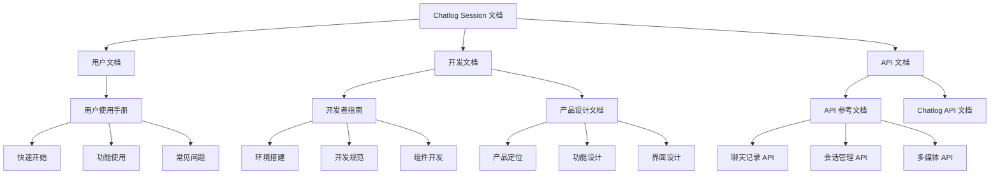

# Chatlog Session 文档中心

欢迎来到 Chatlog Session 的文档中心！这里包含了项目的完整文档，帮助您快速了解和使用本项目。

## 📚 文档导航

### 用户文档

- **[用户使用手册](./USER_GUIDE.md)** 📖
  - 快速开始指南
  - 界面介绍
  - 功能使用说明
  - 常见问题解答
  - 快捷键参考

### 开发文档

- **[开发者指南](./DEVELOPER_GUIDE.md)** 💻
  - 开发环境搭建
  - 项目结构说明
  - 核心技术介绍
  - 开发规范
  - 组件开发指南
  - 测试与部署

- **[产品设计文档](./PRODUCT_DESIGN.md)** 🎨
  - 产品概述与定位
  - 用户分析
  - 功能设计
  - 界面设计规范
  - 技术架构
  - 迭代规划

- **[API 参考文档](./API_REFERENCE.md)** 🔌
  - API 概述
  - 接口详细说明
  - 请求/响应示例
  - 错误处理
  - 使用示例

- **[Chatlog API 文档](../chatlog-api.md)** 🔗
  - Chatlog 后端 API 说明
  - HTTP API 接口
  - Webhook 配置
  - MCP 集成

## 🚀 快速链接

### 新手入门

1. 阅读 [用户使用手册 - 快速开始](./USER_GUIDE.md#1-快速开始)
2. 了解 [界面介绍](./USER_GUIDE.md#2-界面介绍)
3. 学习 [功能使用](./USER_GUIDE.md#3-功能使用)

### 开发者

1. 查看 [开发环境搭建](./DEVELOPER_GUIDE.md#1-开发环境搭建)
2. 了解 [项目结构](./DEVELOPER_GUIDE.md#2-项目结构)
3. 学习 [开发规范](./DEVELOPER_GUIDE.md#4-开发规范)
4. 参考 [API 文档](./API_REFERENCE.md)

### 产品经理/设计师

1. 阅读 [产品设计文档](./PRODUCT_DESIGN.md)
2. 了解 [用户分析](./PRODUCT_DESIGN.md#2-用户分析)
3. 查看 [界面设计规范](./PRODUCT_DESIGN.md#4-界面设计)

## 📋 文档概览

### 用户使用手册
全面介绍如何使用 Chatlog Session，包括功能说明、操作指南和故障排除。

**适合人群**: 所有用户

**主要内容**:
- ✅ 快速开始 - 3分钟上手
- ✅ 功能详解 - 每个功能的使用方法
- ✅ 常见问题 - 快速解决使用中的问题
- ✅ 快捷键 - 提高使用效率

### 开发者指南
详细的开发文档，帮助开发者理解项目架构、参与开发和贡献代码。

**适合人群**: 前端开发者、贡献者

**主要内容**:
- ✅ 环境搭建 - 快速配置开发环境
- ✅ 代码结构 - 了解项目组织方式
- ✅ 开发规范 - 统一的代码风格
- ✅ 组件开发 - Vue 3 组件开发指南
- ✅ 测试部署 - 确保代码质量

### 产品设计文档
完整的产品设计方案，包括需求分析、功能设计、界面设计和技术架构。

**适合人群**: 产品经理、UI/UX 设计师、架构师

**主要内容**:
- ✅ 产品定位 - 核心价值与目标
- ✅ 用户画像 - 目标用户分析
- ✅ 功能设计 - 详细的功能规划
- ✅ 界面设计 - UI/UX 设计规范
- ✅ 技术架构 - 系统架构设计
- ✅ 性能指标 - 性能目标与优化
- ✅ 迭代规划 - 版本路线图

### API 参考文档
完整的 API 接口文档，包括所有接口的详细说明和使用示例。

**适合人群**: 前端开发者、API 集成开发者

**主要内容**:
- ✅ 接口列表 - 所有可用的 API
- ✅ 请求参数 - 详细的参数说明
- ✅ 响应格式 - 返回数据结构
- ✅ 错误处理 - 错误码和处理方法
- ✅ 代码示例 - 多种语言的示例

## 🎯 按角色查找文档

### 我是用户
👉 从 [用户使用手册](./USER_GUIDE.md) 开始

### 我是前端开发者
👉 阅读 [开发者指南](./DEVELOPER_GUIDE.md) 和 [API 参考](./API_REFERENCE.md)

### 我是产品经理
👉 查看 [产品设计文档](./PRODUCT_DESIGN.md)

### 我是 UI/UX 设计师
👉 参考 [产品设计文档 - 界面设计](./PRODUCT_DESIGN.md#4-界面设计)

### 我想贡献代码
👉 阅读 [开发者指南 - 贡献指南](./DEVELOPER_GUIDE.md#12-贡献指南)

## 🔍 按主题查找

### 安装与配置
- [用户使用手册 - 快速开始](./USER_GUIDE.md#1-快速开始)
- [开发者指南 - 开发环境搭建](./DEVELOPER_GUIDE.md#1-开发环境搭建)

### 功能使用
- [用户使用手册 - 功能使用](./USER_GUIDE.md#3-功能使用)
- [产品设计文档 - 功能设计](./PRODUCT_DESIGN.md#3-功能设计)

### 界面与交互
- [用户使用手册 - 界面介绍](./USER_GUIDE.md#2-界面介绍)
- [产品设计文档 - 界面设计](./PRODUCT_DESIGN.md#4-界面设计)
- [产品设计文档 - 交互设计](./PRODUCT_DESIGN.md#7-交互设计)

### 开发与集成
- [开发者指南 - 组件开发](./DEVELOPER_GUIDE.md#5-组件开发)
- [开发者指南 - API 集成](./DEVELOPER_GUIDE.md#6-api-集成)
- [API 参考文档](./API_REFERENCE.md)

### 测试与部署
- [开发者指南 - 测试指南](./DEVELOPER_GUIDE.md#8-测试指南)
- [开发者指南 - 构建部署](./DEVELOPER_GUIDE.md#9-构建部署)

### 问题排查
- [用户使用手册 - 常见问题](./USER_GUIDE.md#4-常见问题)
- [开发者指南 - 调试技巧](./DEVELOPER_GUIDE.md#10-调试技巧)

## 📊 文档结构图

## 💡 文档使用建议

### 首次使用
1. 快速浏览此 README 了解文档结构
2. 根据角色选择对应的文档开始阅读
3. 遇到问题时查阅"常见问题"章节

### 深入学习
1. 完整阅读相关文档
2. 动手实践文档中的示例
3. 参与社区讨论分享经验

### 开发贡献
1. 阅读开发者指南和代码规范
2. 了解项目架构和设计理念
3. 提交 Pull Request 前查看贡献指南

## 🔄 文档更新

### 当前版本
- **版本**: v1.0.0
- **更新日期**: 2025-11
- **状态**: Draft

### 更新记录
- 2025-11: 创建初始文档

### 计划更新
- [ ] 添加更多使用案例
- [ ] 补充视频教程
- [ ] 完善 API 示例
- [ ] 添加故障排查流程图

## 📞 获取帮助

### 文档相关问题
如果您在阅读文档时遇到问题或发现错误：
- 提交 [Issue](https://github.com/xlight/chatlog-session/issues)
- 在 [Discussions](https://github.com/xlight/chatlog-session/discussions) 中讨论
- 提交 PR 帮助改进文档

### 使用中的问题
- 查看 [常见问题](./USER_GUIDE.md#4-常见问题)
- 搜索 [已关闭的 Issues](https://github.com/xlight/chatlog-session/issues?q=is%3Aissue+is%3Aclosed)
- 提交新的 Issue 描述您的问题

### 功能建议
我们欢迎各种建议和反馈：
- 在 [Discussions](https://github.com/xlight/chatlog-session/discussions) 发起讨论
- 提交功能请求 Issue
- 查看 [产品路线图](./PRODUCT_DESIGN.md#10-迭代规划)

## 🤝 参与贡献

### 改进文档
文档是项目的重要组成部分，我们欢迎您：
- 修正错别字和语法错误
- 补充缺失的内容
- 添加使用案例和示例
- 翻译文档到其他语言

### 贡献代码
- 阅读 [开发者指南](./DEVELOPER_GUIDE.md)
- 查看 [贡献指南](./DEVELOPER_GUIDE.md#12-贡献指南)
- Fork 项目并提交 PR

## 🔗 相关资源

### 项目链接
- [GitHub 仓库](https://github.com/xlight/chatlog-session)
- [Chatlog 后端项目](https://github.com/sjzar/chatlog)
- [问题追踪](https://github.com/xlight/chatlog-session/issues)
- [讨论区](https://github.com/xlight/chatlog-session/discussions)

### 外部资源
- [Vue.js 官方文档](https://vuejs.org/)
- [TypeScript 文档](https://www.typescriptlang.org/)
- [Vite 文档](https://vitejs.dev/)
- [Element Plus 文档](https://element-plus.org/)

## 📄 许可证

本文档遵循项目的 [Apache-2.0 许可证](../LICENSE)。

---

**感谢您阅读我们的文档！**

如有任何问题或建议，欢迎随时联系我们。

[⬆ 返回顶部](#chatlog-session-文档中心)

