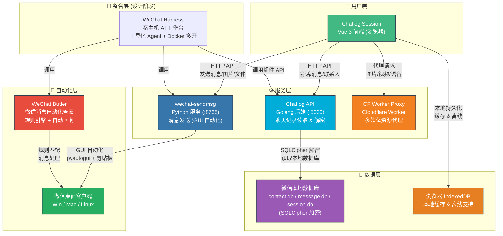
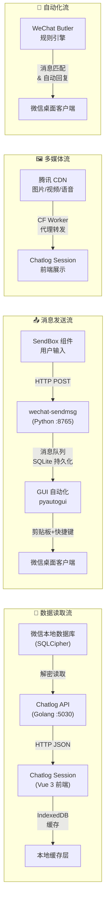
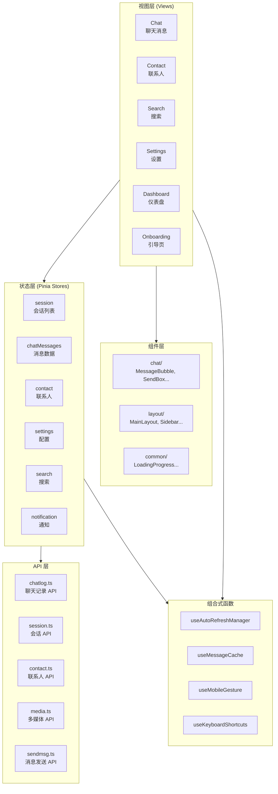
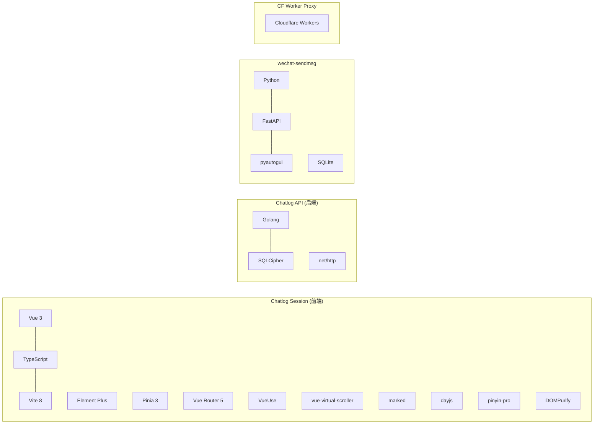

# Chatlog Session 文档中心

项目全部文档索引（含外部文档中心 889 篇）。🗺️ 全局文档地图见 [external-docs/docs-map.md](external-docs/docs-map.md)，归档文档见 external-docs/_archive/。

---

## 生态系统架构总览

Chatlog 生态由多个子项目协同工作，共同实现微信聊天记录的**读取 → 查看 → 搜索 → 发送 → 自动化**全链路能力。


```mermaid
graph TB
    subgraph 用户层["👤 用户层"]
        Browser["Chatlog Session<br/>Vue 3 前端 (浏览器)"]
    end

    subgraph 服务层["⚙️ 服务层"]
        ChatlogAPI["Chatlog API<br/>Golang 后端 (:5030)<br/>聊天记录读取 & 解密"]
        SendMsg["wechat-sendmsg<br/>Python 服务 (:8765)<br/>消息发送 (GUI 自动化)"]
        CFWorker["CF Worker Proxy<br/>Cloudflare Worker<br/>多媒体资源代理"]
    end

    subgraph 数据层["💾 数据层"]
        WeChatDB["微信本地数据库<br/>contact.db / message.db / session.db<br/>(SQLCipher 加密)"]
        IndexedDB["浏览器 IndexedDB<br/>本地缓存 & 离线支持"]
    end

    subgraph 自动化层["🤖 自动化层"]
        Butler["WeChat Butler<br/>微信消息自动化管家<br/>规则引擎 + 自动回复"]
        WeChatClient["微信桌面客户端<br/>Win / Mac / Linux"]
    end

    subgraph 整合层["🧩 整合层 (设计阶段)"]
        Harness["WeChat Harness<br/>宿主机 AI 工作台<br/>工具化 Agent + Docker 多开"]
    end

    Browser -->|"HTTP API<br/>会话/消息/联系人"| ChatlogAPI
    Browser -->|"HTTP API<br/>发送消息/图片/文件"| SendMsg
    Browser -->|"代理请求<br/>图片/视频/语音"| CFWorker
    ChatlogAPI -->|"SQLCipher 解密<br/>读取本地数据库"| WeChatDB
    SendMsg -->|"GUI 自动化<br/>pyautogui + 剪贴板"| WeChatClient
    Butler -->|"规则匹配<br/>消息处理"| WeChatClient
    Browser -->|"本地持久化<br/>缓存 & 离线"| IndexedDB
    Harness -->|"调用组件 API"| ChatlogAPI
    Harness -->|"调用"| SendMsg
    Harness -->|"调用"| Butler

    style Browser fill:#42b883,stroke:#2c3e50,color:#fff
    style ChatlogAPI fill:#00ADD8,stroke:#2c3e50,color:#fff
    style SendMsg fill:#3776AB,stroke:#2c3e50,color:#fff
    style CFWorker fill:#F38020,stroke:#2c3e50,color:#fff
    style WeChatDB fill:#9B59B6,stroke:#2c3e50,color:#fff
    style IndexedDB fill:#E67E22,stroke:#2c3e50,color:#fff
    style Butler fill:#E74C3C,stroke:#2c3e50,color:#fff
    style WeChatClient fill:#27AE60,stroke:#2c3e50,color:#fff
```

### 数据流架构


```mermaid
flowchart LR
    subgraph 数据读取流["📖 数据读取流"]
        A1["微信本地数据库<br/>(SQLCipher)"] -->|"解密读取"| A2["Chatlog API<br/>(Golang :5030)"]
        A2 -->|"HTTP JSON"| A3["Chatlog Session<br/>(Vue 3 前端)"]
        A3 -->|"IndexedDB<br/>缓存"| A4["本地缓存层"]
    end

    subgraph 消息发送流["📤 消息发送流"]
        B1["SendBox 组件<br/>用户输入"] -->|"HTTP POST"| B2["wechat-sendmsg<br/>(Python :8765)"]
        B2 -->|"消息队列<br/>SQLite 持久化"| B3["GUI 自动化<br/>pyautogui"]
        B3 -->|"剪贴板+快捷键"| B4["微信桌面客户端"]
    end

    subgraph 多媒体流["🖼️ 多媒体流"]
        C1["腾讯 CDN<br/>图片/视频/语音"] -->|"CF Worker<br/>代理转发"| C2["Chatlog Session<br/>前端展示"]
    end

    subgraph 自动化流["🤖 自动化流"]
        D1["WeChat Butler<br/>规则引擎"] -->|"消息匹配<br/>& 自动回复"| D2["微信桌面客户端"]
    end
```

---

## 子项目概览

| 子项目 | 定位 | 技术栈 | 端口 | 核心能力 |
|--------|------|--------|------|----------|
| **Chatlog Session** | 微信聊天记录查看器 | Vue 3 + TS + Vite + Pinia | — | 会话浏览、消息查看、联系人管理、全文搜索、消息发送、数据导出 |
| **Chatlog API** | 聊天记录读取 & 解密服务 | Golang + SQLCipher | :5030 | 数据库解密、会话查询、消息分页、联系人读取、多媒体代理 |
| **wechat-sendmsg** | 微信消息发送工具 | Python + FastAPI + pyautogui | :8765 | 文本/图片/文件发送、消息队列持久化、重试机制、MCP 协议 |
| **CF Worker Proxy** | 多媒体资源代理 | Cloudflare Workers | — | 腾讯域名白名单代理、CORS 头注入、来源验证 |
| **WeChat Butler** | 微信消息自动化管家 | 规划中 | — | 规则引擎、消息匹配、自动回复、系统集成 |
| **WeChat Harness** | 宿主机 AI 工作台（设计阶段） | 设计文档 external-docs/harness/ | — | 工具化 Agent、Docker 多开、办公+社交辅助 |

### Chatlog Session 前端架构


```mermaid
graph TB
    subgraph Views["视图层 (Views)"]
        Chat["Chat<br/>聊天消息"]
        Contact["Contact<br/>联系人"]
        Search["Search<br/>搜索"]
        Settings["Settings<br/>设置"]
        Dashboard["Dashboard<br/>仪表盘"]
        Onboarding["Onboarding<br/>引导页"]
    end

    subgraph Stores["状态层 (Pinia Stores)"]
        SessionStore["session<br/>会话列表"]
        ChatStore["chatMessages<br/>消息数据"]
        ContactStore["contact<br/>联系人"]
        SettingsStore["settings<br/>配置"]
        SearchStore["search<br/>搜索"]
        NotificationStore["notification<br/>通知"]
    end

    subgraph API["API 层"]
        ChatlogAPI["chatlog.ts<br/>聊天记录 API"]
        SessionAPI["session.ts<br/>会话 API"]
        ContactAPI["contact.ts<br/>联系人 API"]
        MediaAPI["media.ts<br/>多媒体 API"]
        SendmsgAPI["sendmsg.ts<br/>消息发送 API"]
    end

    subgraph Components["组件层"]
        ChatComponents["chat/<br/>MessageBubble, SendBox..."]
        LayoutComponents["layout/<br/>MainLayout, Sidebar..."]
        CommonComponents["common/<br/>LoadingProgress..."]
    end

    subgraph Composables["组合式函数"]
        AutoRefresh["useAutoRefreshManager"]
        MessageCache["useMessageCache"]
        MobileGesture["useMobileGesture"]
        KeyboardShortcuts["useKeyboardShortcuts"]
    end

    Views --> Stores
    Stores --> API
    Views --> Components
    Views --> Composables
    Stores --> Composables
```

---

## 技术栈全景


```mermaid
graph LR
    subgraph 前端["Chatlog Session (前端)"]
        Vue["Vue 3"]
        TS["TypeScript"]
        Vite["Vite 8"]
        EP["Element Plus"]
        Pinia["Pinia 3"]
        VueRouter["Vue Router 5"]
        VueUse["VueUse"]
        VirtualScroller["vue-virtual-scroller"]
        Marked["marked"]
        Dayjs["dayjs"]
        Pinyin["pinyin-pro"]
        DOMPurify["DOMPurify"]
    end

    subgraph 后端["Chatlog API (后端)"]
        Go["Golang"]
        SQLCipher["SQLCipher"]
        HTTP["net/http"]
    end

    subgraph 发送["wechat-sendmsg"]
        Python["Python"]
        FastAPI["FastAPI"]
        PyAutoGUI["pyautogui"]
        SQLite["SQLite"]
    end

    subgraph 代理["CF Worker Proxy"]
        CF["Cloudflare Workers"]
    end

    Vue --- TS --- Vite
    Go --- SQLCipher
    Python --- FastAPI --- PyAutoGUI
```

---

## 文档目录结构

```
docs/
├── faq.md                                # 常见问题
├── community-analysis-and-improvement-plan.md # 社区对比分析与改进规划
├── changelog/                            # 版本变更日志 (29 篇)
│   ├── CHANGELOG_v0.2.0.md ~ v0.25.0.md
│   └── ...
└── external-docs/                        # 外部文档中心 (symlink → chatlog-session-docs)
    ├── docs-map.md                       # 🗺️ 全仓文档地图（找文档先看这里）
    ├── harness/                          # 🧩 Harness 系统设计（design 15 + analysis 5）
    ├── chatlog-session/                  # 🖥️ 前端文档（原根目录散落目录归位）
    │   ├── api/  architecture/  features/  guides/  fixes/  issues/
    │   ├── design/  performance/  refactoring/  examples/  deployment/
    │   ├── planning/  references/  troubleshooting/  assets/  icons/  scripts/
    ├── chatshell-api/                    # 📖 后端文档（原 backend-golang/）
    │   ├── db-analysis/  db-copy/  implementation/  optimizations/  refactoring/
    │   ├── mcp.md  http-api.md  fts-search-analysis.md  explore/  research/
    │   └── api/ → chatlog-session/api (symlink)
    ├── wechat-sendmsg/                   # 💬 消息发送（v0.26.0 集成设计）
    ├── wechat-butler/                    # 🤖 AI 层（原 agent/butler/）
    ├── agent/                            # 🔌 Agent/MCP 集成设计 + archive/
    ├── business/                         # 💼 商业/品牌/传播
    ├── openspec/                         # 📐 OpenSpec 规格
    ├── reference/                        # 📚 竞品与参考（原 其他同类工具/）
    ├── cf-worker-proxy/                  # 多媒体资源代理
    ├── _archive/                         # 🗄️ 历史归档（按主题分桶）
    ├── CHANGELOG.md  ROADMAP.md  TODO.md # 仓库入口文档
```

---

## 文档导航

### 组件 × 能力矩阵

| 组件 | 📖 读取 | 👀 查看/渲染 | 🔍 搜索 | 📤 发送 | 🤖 自动化 |
|------|---------|-------------|---------|---------|----------|
| **chatlog-session/** | [API 参考](external-docs/chatlog-session/api/reference.md) | [消息加载流程](external-docs/chatlog-session/architecture/core/message-loading-flow.md) | [全文搜索](external-docs/chatlog-session/features/search/search-feature.md) | [消息渲染](external-docs/chatlog-session/features/messages/) | [后台加载](external-docs/chatlog-session/features/background/) |
| **chatshell-api/** | [后端索引](external-docs/chatshell-api/README.md) | [多媒体解密](external-docs/chatshell-api/moment-media-decrypt.md) | [FTS 搜索](external-docs/chatshell-api/fts-search-analysis.md) | — | [MCP](external-docs/chatshell-api/mcp.md) |
| **wechat-sendmsg/** | — | — | — | [集成设计](external-docs/wechat-sendmsg/v0.26.0-sendmsg-integration.md) | — |
| **wechat-butler/** | — | — | — | — | [Butler 概览](external-docs/wechat-butler/README.md) |
| **agent/** | — | — | — | — | [Agent 集成](external-docs/agent/integration-design.md) |
| **harness/** | [设计总览](external-docs/harness/design/01-overview.md) | [UI 设计](external-docs/harness/design/05-ui.md) | — | — | [实施计划](external-docs/harness/design/11-implementation-plan.md) |

> 🗺️ 以 harness 目标规划为视角的完整索引见 [全仓文档地图](external-docs/docs-map.md)。

### 按主题查找

| 主题 | 关键文档 |
|------|---------|
| 消息加载 | [完整流程](external-docs/chatlog-session/architecture/core/message-loading-flow.md) / [快速参考](external-docs/chatlog-session/architecture/core/message-loading-quick-reference.md) |
| 性能优化 | [Contact DB 模式](external-docs/chatlog-session/features/contact/contact-db-mode.md) / [虚拟滚动](external-docs/chatlog-session/features/performance/virtual-scroll.md) / [拼音优化](external-docs/chatlog-session/performance/pinyin-optimization.md) |
| 数据管理 | [数据结构](external-docs/chatlog-session/api/data-structure.md) / [分页机制](external-docs/chatlog-session/api/pagination.md) / [会话映射](external-docs/chatlog-session/api/session-mapping.md) |
| 部署运维 | [GitHub Pages](external-docs/chatlog-session/deployment/github-pages.md) / [PWA 配置](external-docs/chatlog-session/guides/pwa-setup-guide.md) / [故障排查](external-docs/chatlog-session/troubleshooting/) |
| 移动端 | [主布局](external-docs/chatlog-session/architecture/ui/main-layout.md) / [视图切换](external-docs/chatlog-session/architecture/ui/view-switching.md) / [移动端 UI](external-docs/chatlog-session/features/ui/mobile/mobile-ui.md) |

---

## 版本历程

| 版本 | 日期 | 里程碑 |
|------|------|--------|
| v0.26.0 | 2026-05-08 | SendMsg 集成、微信风格 SendBox、可配置快捷键 |
| v0.25.0 | 2026-05-06 | 链接消息、Live Photo 高清修复、Vite v8 |
| v0.24.0 | 2026-04-13 | 收藏消息类型支持 |
| v0.22.0 | 2026-03-12 | Gap 置信度分级、锚点逻辑统一 |
| v0.20.0 | 2026-03-11 | EmptyRange 窗口探测优化 |
| v0.16.0 | 2026-02-11 | 聊天记录导出 (JSON/CSV/TXT/Markdown) |
| v0.15.0 | 2025-12-05 | 会话置顶、Live Photo、Dashboard 重构、PWA |
| v0.14.0 | 2025-11-25 | 转发消息增强、EmptyRange/Gap/Revoke 虚拟消息 |
| v0.10.0 | 2025-01-24 | 群聊管理、搜索、IndexedDB v3、智能消息加载 |
| v0.9.0 | 2025-11-21 | 移动端响应式布局、keep-alive 缓存 |

完整版本记录见 [ROADMAP.md](external-docs/ROADMAP.md) 和 [CHANGELOG.md](external-docs/CHANGELOG.md)。

---

## 文档统计

| 分类 | 数量 |
|------|------|
| 总文档数 | 889 篇 |
| harness/（整合层设计） | 21 篇 |
| chatlog-session/（前端） | 138 篇 |
| chatshell-api/（后端） | 191 篇 |
| openspec/（规格） | 393 篇 |
| business/（商业） | 20 篇 |
| wechat-butler/（AI 层） | 19 篇 |
| agent/（Agent 集成） | 8 篇 |
| _archive/（归档） | 60 篇 |

---

## docs/

- [faq.md](faq.md) — 常见问题 (FAQ)
- [community-analysis-and-improvement-plan.md](community-analysis-and-improvement-plan.md) — 社区对比分析与改进规划（竞品调研 + TODO 盘点 + 优先级排序）

### changelog/

- [CHANGELOG_v0.10.0.md](changelog/CHANGELOG_v0.10.0.md) — v0.10.0. 变更日志
- [CHANGELOG_v0.11.0.md](changelog/CHANGELOG_v0.11.0.md) — v0.11.0. 变更日志
- [CHANGELOG_v0.12.0.md](changelog/CHANGELOG_v0.12.0.md) — v0.12.0. 变更日志
- [CHANGELOG_v0.13.0.md](changelog/CHANGELOG_v0.13.0.md) — v0.13.0. 变更日志
- [CHANGELOG_v0.14.0.md](changelog/CHANGELOG_v0.14.0.md) — v0.14.0. 变更日志
- [CHANGELOG_v0.15.0.md](changelog/CHANGELOG_v0.15.0.md) — v0.15.0. 变更日志
- [CHANGELOG_v0.16.0.md](changelog/CHANGELOG_v0.16.0.md) — v0.16.0. 变更日志
- [CHANGELOG_v0.17.0.md](changelog/CHANGELOG_v0.17.0.md) — v0.17.0. 变更日志
- [CHANGELOG_v0.18.0.md](changelog/CHANGELOG_v0.18.0.md) — v0.18.0. 变更日志
- [CHANGELOG_v0.19.0.md](changelog/CHANGELOG_v0.19.0.md) — v0.19.0. 变更日志
- [CHANGELOG_v0.2.0.md](changelog/CHANGELOG_v0.2.0.md) — v0.2.0. 变更日志
- [CHANGELOG_v0.20.0.md](changelog/CHANGELOG_v0.20.0.md) — v0.20.0. 变更日志
- [CHANGELOG_v0.21.0.md](changelog/CHANGELOG_v0.21.0.md) — v0.21.0. 变更日志
- [CHANGELOG_v0.22.0.md](changelog/CHANGELOG_v0.22.0.md) — v0.22.0. 变更日志
- [CHANGELOG_v0.24.0.md](changelog/CHANGELOG_v0.24.0.md) — v0.24.0. 变更日志
- [CHANGELOG_v0.25.0.md](changelog/CHANGELOG_v0.25.0.md) — v0.25.0. 变更日志
- [CHANGELOG_v0.3.0.md](changelog/CHANGELOG_v0.3.0.md) — v0.3.0. 变更日志
- [CHANGELOG_v0.3.1.md](changelog/CHANGELOG_v0.3.1.md) — v0.3.1. 变更日志
- [CHANGELOG_v0.3.2_summary.md](changelog/CHANGELOG_v0.3.2_summary.md) — v0.3.2 变更日志
- [CHANGELOG_v0.3.3.md](changelog/CHANGELOG_v0.3.3.md) — v0.3.3. 变更日志
- [CHANGELOG_v0.4.0.md](changelog/CHANGELOG_v0.4.0.md) — v0.4.0. 变更日志
- [CHANGELOG_v0.4.1.md](changelog/CHANGELOG_v0.4.1.md) — v0.4.1. 变更日志
- [CHANGELOG_v0.5.0.md](changelog/CHANGELOG_v0.5.0.md) — v0.5.0. 变更日志
- [CHANGELOG_v0.5.1.md](changelog/CHANGELOG_v0.5.1.md) — v0.5.1. 变更日志
- [CHANGELOG_v0.6.0.md](changelog/CHANGELOG_v0.6.0.md) — v0.6.0. 变更日志
- [CHANGELOG_v0.7.0.md](changelog/CHANGELOG_v0.7.0.md) — v0.7.0. 变更日志
- [CHANGELOG_v0.8.0.md](changelog/CHANGELOG_v0.8.0.md) — v0.8.0. 变更日志
- [CHANGELOG_v0.9.0.md](changelog/CHANGELOG_v0.9.0.md) — v0.9.0. 变更日志
- [CHANGELOG_v0.9.2.md](changelog/CHANGELOG_v0.9.2.md) — v0.9.2. 变更日志

## docs/external-docs/

### 根目录/ (3 篇)

- [CHANGELOG.md](external-docs/CHANGELOG.md) — Changelog
- [ROADMAP.md](external-docs/ROADMAP.md) — 文档信息
- [TODO.md](external-docs/TODO.md) — TODO

### 整合层 harness/ (21 篇)

- [harness/README.md](external-docs/harness/README.md) — Harness 设计文档中心
- [design/01-overview.md](external-docs/harness/design/01-overview.md) — 设计总览（目标/边界/路线）
- [design/02-architecture.md](external-docs/harness/design/02-architecture.md) — 系统架构
- [design/05-ui.md](external-docs/harness/design/05-ui.md) — UI 设计
- [design/11-implementation-plan.md](external-docs/harness/design/11-implementation-plan.md) — 实施计划（任务组 A0-F）
- [design/15-decision-details.md](external-docs/harness/design/15-decision-details.md) — 关键决策（D6-D9/Q1-Q6）
- [analysis/wechat-on-cloud-macos-validation.md](external-docs/harness/analysis/wechat-on-cloud-macos-validation.md) — macOS 运行 WechatOnCloud 验证
- [analysis/container-wechat-data-readability.md](external-docs/harness/analysis/container-wechat-data-readability.md) — 容器内读库可行性
- [analysis/](external-docs/harness/analysis/) — 全部调研记录（社区/组件审计/引擎启示）

### API 文档/ (26 篇)

- [chatlog-session/api/data-structure.md](external-docs/chatlog-session/api/data-structure.md) — 概述
- [chatlog-session/api/http-api.md](external-docs/chatlog-session/api/http-api.md) — Chatlog HTTP API 文档
- [chatlog-session/api/pagination.md](external-docs/chatlog-session/api/pagination.md) — 概述
- [chatlog-session/api/reference.md](external-docs/chatlog-session/api/reference.md) — 目录
- [chatlog-session/api/response-fix.md](external-docs/chatlog-session/api/response-fix.md) — API 响应处理修复说明
- [chatlog-session/api/session-mapping.md](external-docs/chatlog-session/api/session-mapping.md) — 概述
- [chatlog-session/api/examples/auto-decrypt.md](external-docs/chatlog-session/api/examples/auto-decrypt.md) — auto-decrypt
- [chatlog-session/api/examples/chatlog-2.md](external-docs/chatlog-session/api/examples/chatlog-2.md) — /api/v1/chatlog
- [chatlog-session/api/examples/chatlog.md](external-docs/chatlog-session/api/examples/chatlog.md) — /api/v1/chatlog
- [chatlog-session/api/examples/chatroom.md](external-docs/chatlog-session/api/examples/chatroom.md) — https://chatlog.x.qiubobo.com:60443/api/v1/chatroom?keywo...
- [chatlog-session/api/examples/contact.md](external-docs/chatlog-session/api/examples/contact.md) — {
- [chatlog-session/api/examples/dashboard.md](external-docs/chatlog-session/api/examples/dashboard.md) — 数据总览
- [chatlog-session/api/examples/decrypt.md](external-docs/chatlog-session/api/examples/decrypt.md) — POST /api/v1/actions/decrypt
- [chatlog-session/api/examples/diary-2.md](external-docs/chatlog-session/api/examples/diary-2.md) — diary-2
- [chatlog-session/api/examples/diary.md](external-docs/chatlog-session/api/examples/diary.md) — diary
- [chatlog-session/api/examples/msgtype-emoji-not-downloaded.md](external-docs/chatlog-session/api/examples/msgtype-emoji-not-downloaded.md) — 暂不支持的表情包
- [chatlog-session/api/examples/msgtype-fav.md](external-docs/chatlog-session/api/examples/msgtype-fav.md) — 收藏类的消息
- [chatlog-session/api/examples/msgtype-file-downloading.md](external-docs/chatlog-session/api/examples/msgtype-file-downloading.md) — chatlog 返回数据结构 下载中的文件
- [chatlog-session/api/examples/msgtype-forward-group.md](external-docs/chatlog-session/api/examples/msgtype-forward-group.md) — 多选转发的消息，包含附件
- [chatlog-session/api/examples/msgtype-link.md](external-docs/chatlog-session/api/examples/msgtype-link.md) — chatlog 返回数据结构 qqmail
- [chatlog-session/api/examples/msgtype-qqmail.md](external-docs/chatlog-session/api/examples/msgtype-qqmail.md) — chatlog 返回数据结构 qqmail
- [chatlog-session/api/examples/msgtype-voicecall.md](external-docs/chatlog-session/api/examples/msgtype-voicecall.md) — chatlog 返回数据结构 下载中的文件
- [chatlog-session/api/examples/search.md](external-docs/chatlog-session/api/examples/search.md) — search
- [chatlog-session/api/examples/session-v2.md](external-docs/chatlog-session/api/examples/session-v2.md) — 请求近期聊天session列表
- [chatlog-session/api/examples/session.md](external-docs/chatlog-session/api/examples/session.md) — 请求近期聊天session列表
- [chatlog-session/api/examples/setting.md](external-docs/chatlog-session/api/examples/setting.md) — setting

### 架构设计/ (5 篇)

- [chatlog-session/architecture/product-design.md](external-docs/chatlog-session/architecture/product-design.md) — 目录
- [chatlog-session/architecture/core/message-loading-flow.md](external-docs/chatlog-session/architecture/core/message-loading-flow.md) — 概述
- [chatlog-session/architecture/core/message-loading-quick-reference.md](external-docs/chatlog-session/architecture/core/message-loading-quick-reference.md) — 核心流程图
- [chatlog-session/architecture/ui/main-layout.md](external-docs/chatlog-session/architecture/ui/main-layout.md) — 概述
- [chatlog-session/architecture/ui/view-switching.md](external-docs/chatlog-session/architecture/ui/view-switching.md) — 概述

### 后端 chatshell-api/ (57 篇)

- [chatshell-api/Sarv微信聊天记录解密.md](external-docs/chatshell-api/Sarv微信聊天记录解密.md) — 概述
- [chatshell-api/[原创]wx新版本（after4.0）数据库key逆向.md](external-docs/chatshell-api/[原创]wx新版本（after4.0）数据库key逆向.md) — 1、 前提
- [chatshell-api/fts-native-testing-report.md](external-docs/chatshell-api/fts-native-testing-report.md) — 测试日期
- [chatshell-api/sqlcipher-data-realtime-fix.md](external-docs/chatshell-api/sqlcipher-data-realtime-fix.md) — 文档信息
- [chatshell-api/sqlcipher-migration.md](external-docs/chatshell-api/sqlcipher-migration.md) — SQLCipher 迁移指南
- [chatshell-api/troubleshooting-sqlcipher.md](external-docs/chatshell-api/troubleshooting-sqlcipher.md) — SQLCipher 故障排除指南
- [chatshell-api/使用pysqlcipher3操作Windows微信数据库.md](external-docs/chatshell-api/使用pysqlcipher3操作Windows微信数据库.md) — 使用pysqlcipher3操作Windows微信数据库
- [chatshell-api/db-analysis/contact_db_analysis.md](external-docs/chatshell-api/db-analysis/contact_db_analysis.md) — SQLite 数据库结构分析报告：contact.db
- [chatshell-api/db-analysis/contact_db_deep_analysis.md](external-docs/chatshell-api/db-analysis/contact_db_deep_analysis.md) — SQLite 数据库深度分析报告：contact.db
- [chatshell-api/db-analysis/darwin_v4_vfs_analysis.md](external-docs/chatshell-api/db-analysis/darwin_v4_vfs_analysis.md) — Darwin V4 微信数据库 VFS 测试分析报告
- [chatshell-api/db-analysis/emoticon_db_analysis.md](external-docs/chatshell-api/db-analysis/emoticon_db_analysis.md) — emoticon.db 深度分析报告
- [chatshell-api/db-analysis/favorite_db_analysis.md](external-docs/chatshell-api/db-analysis/favorite_db_analysis.md) — favorite.db 深度分析报告
- [chatshell-api/db-analysis/general_db_analysis.md](external-docs/chatshell-api/db-analysis/general_db_analysis.md) — general.db 深度分析报告
- [chatshell-api/db-analysis/hardlink_db_analysis.md](external-docs/chatshell-api/db-analysis/hardlink_db_analysis.md) — hardlink.db 深度分析报告
- [chatshell-api/db-analysis/message_db_analysis.md](external-docs/chatshell-api/db-analysis/message_db_analysis.md) — SQLite 数据库深度分析报告：Message 数据库群
- [chatshell-api/db-analysis/other_db_analysis.md](external-docs/chatshell-api/db-analysis/other_db_analysis.md) — SQLite 数据库深度分析报告：其他功能数据库
- [chatshell-api/db-analysis/session_db_analysis.md](external-docs/chatshell-api/db-analysis/session_db_analysis.md) — SQLite 数据库深度分析报告：session.db
- [chatshell-api/db-copy/application_file_copy_analysis.md](external-docs/chatshell-api/db-copy/application_file_copy_analysis.md) — 文件复制解密逻辑流程图
- [chatshell-api/db-copy/copy_temp_analysis.md](external-docs/chatshell-api/db-copy/copy_temp_analysis.md) — User
- [chatshell-api/db-copy/direct_access_wechat_db.md](external-docs/chatshell-api/db-copy/direct_access_wechat_db.md) — User
- [chatshell-api/db-copy/error_filecopy_delete.md](external-docs/chatshell-api/db-copy/error_filecopy_delete.md) — 问题总结
- [chatshell-api/db-copy/issues_direct_open.md](external-docs/chatshell-api/db-copy/issues_direct_open.md) — 解决方案
- [chatshell-api/db-copy/optimization_general.md](external-docs/chatshell-api/db-copy/optimization_general.md) — 1. 问题分析
- [chatshell-api/db-copy/optimization_io.md](external-docs/chatshell-api/db-copy/optimization_io.md) — FileCopy IO 优化方案
- [chatshell-api/db-copy/rationale_copy_temp.md](external-docs/chatshell-api/db-copy/rationale_copy_temp.md) — 为什么 Windows 下一定要临时复制？
- [chatshell-api/db-copy/sqlite_incremental_backup.md](external-docs/chatshell-api/db-copy/sqlite_incremental_backup.md) — User
- [chatshell-api/db-copy/vfs_compatibility.md](external-docs/chatshell-api/db-copy/vfs_compatibility.md) — 概述
- [chatshell-api/db-copy/vfs_integration.md](external-docs/chatshell-api/db-copy/vfs_integration.md) — VFS 集成文档
- [chatshell-api/implementation/debug_logging.md](external-docs/chatshell-api/implementation/debug_logging.md) — 1. 目标
- [chatshell-api/implementation/decryption_logic.md](external-docs/chatshell-api/implementation/decryption_logic.md) — ChatLog Decrypt 流程详解
- [chatshell-api/implementation/image_decryption_fix.md](external-docs/chatshell-api/implementation/image_decryption_fix.md) — 问题背景
- [chatshell-api/implementation/template_extraction.md](external-docs/chatshell-api/implementation/template_extraction.md) — 概述
- [chatshell-api/optimizations/dat_to_img_conversion.md](external-docs/chatshell-api/optimizations/dat_to_img_conversion.md) — 1. 背景
- [chatshell-api/optimizations/http_server.md](external-docs/chatshell-api/optimizations/http_server.md) — 1. 问题分析
- [chatshell-api/optimizations/indexer_performance.md](external-docs/chatshell-api/optimizations/indexer_performance.md) — 1. 问题分析
- [chatshell-api/optimizations/indexer_startup.md](external-docs/chatshell-api/optimizations/indexer_startup.md) — 1. 问题分析
- [chatshell-api/optimizations/mcp_protocol.md](external-docs/chatshell-api/optimizations/mcp_protocol.md) — 1. 问题分析
- [chatshell-api/optimizations/wechat_db_access.md](external-docs/chatshell-api/optimizations/wechat_db_access.md) — 1. 问题分析
- [chatshell-api/optimizations/wechat_initialization.md](external-docs/chatshell-api/optimizations/wechat_initialization.md) — 1. 问题分析
- [chatshell-api/refactoring/http_router_refactor.md](external-docs/chatshell-api/refactoring/http_router_refactor.md) — 概述
- [chatshell-api/refactoring/large_files_analysis.md](external-docs/chatshell-api/refactoring/large_files_analysis.md) — 一些较大的代码文件
- [chatshell-api/TODO.md](external-docs/chatshell-api/TODO.md) — 后端待办
- [chatshell-api/command-migration.md](external-docs/chatshell-api/command-migration.md) — 命令迁移
- [chatshell-api/dashboard-analysis/](external-docs/chatshell-api/dashboard-analysis/) — 仪表盘数据设计
- [chatshell-api/dbquery-guide.md](external-docs/chatshell-api/dbquery-guide.md) — 数据库查询指南
- [chatshell-api/docker.md](external-docs/chatshell-api/docker.md) — Docker 部署
- [chatshell-api/forwarded-media-backend-analysis.md](external-docs/chatshell-api/forwarded-media-backend-analysis.md) — 转发媒体后端分析
- [chatshell-api/fts-search-analysis.md](external-docs/chatshell-api/fts-search-analysis.md) — FTS 搜索分析
- [chatshell-api/github-workflow.md](external-docs/chatshell-api/github-workflow.md) — GitHub Actions 工作流
- [chatshell-api/http-api.md](external-docs/chatshell-api/http-api.md) — HTTP API 说明
- [chatshell-api/mcp.md](external-docs/chatshell-api/mcp.md) — MCP 协议支持
- [chatshell-api/prompt.md](external-docs/chatshell-api/prompt.md) — Prompt 说明
- [chatshell-api/research/](external-docs/chatshell-api/research/) — 数据利用审计与库分析
- [chatshell-api/sns-image-display.md](external-docs/chatshell-api/sns-image-display.md) — 朋友圈图片显示
- [chatshell-api/speech.md](external-docs/chatshell-api/speech.md) — 语音能力
- [chatshell-api/test-db-storage-schema.md](external-docs/chatshell-api/test-db-storage-schema.md) — 测试库表结构
- [chatshell-api/unified-config.md](external-docs/chatshell-api/unified-config.md) — 统一配置

### 部署指南/ (3 篇)

- [chatlog-session/deployment/custom-path.md](external-docs/chatlog-session/deployment/custom-path.md) — 自定义路径部署指南
- [chatlog-session/deployment/github-pages.md](external-docs/chatlog-session/deployment/github-pages.md) — GitHub Pages 部署指南
- [chatlog-session/deployment/other-platforms.md](external-docs/chatlog-session/deployment/other-platforms.md) — 其他部署平台指南

### 消息发送 wechat-sendmsg/ (21 篇)

- [README.md](external-docs/wechat-sendmsg/README.md) — 文档索引
- [guides/quick-start.md](external-docs/wechat-sendmsg/guides/quick-start.md) — 快速开始指南
- [guides/avoid-ban.md](external-docs/wechat-sendmsg/guides/avoid-ban.md) — 防封号使用指南
- [guides/anti-ban-guide.md](external-docs/wechat-sendmsg/guides/anti-ban-guide.md) — 防封号系统详细说明
- [guides/macos-guide.md](external-docs/wechat-sendmsg/guides/macos-guide.md) — macOS 指南
- [guides/cross-platform-guide.md](external-docs/wechat-sendmsg/guides/cross-platform-guide.md) — 跨平台指南
- [api/api-reference.md](external-docs/wechat-sendmsg/api/api-reference.md) — HTTP API 参考
- [design/technical-implementation.md](external-docs/wechat-sendmsg/design/technical-implementation.md) — 技术实现文档
- [design/send-file-flow-design.md](external-docs/wechat-sendmsg/design/send-file-flow-design.md) — 发送文件/图片流程设计
- [design/send-image-file-analysis.md](external-docs/wechat-sendmsg/design/send-image-file-analysis.md) — 发送图片/文件选型分析
- [design/codebase-refactor-analysis.md](external-docs/wechat-sendmsg/design/codebase-refactor-analysis.md) — 代码库重构分析
- [design/upgrade-plan.md](external-docs/wechat-sendmsg/design/upgrade-plan.md) — 升级规划
- [fixes/window-detection-fixes.md](external-docs/wechat-sendmsg/fixes/window-detection-fixes.md) — 窗口检测改进
- [fixes/tray-recovery-improvement.md](external-docs/wechat-sendmsg/fixes/tray-recovery-improvement.md) — 托盘恢复改进
- [fixes/uia-session-list-fix.md](external-docs/wechat-sendmsg/fixes/uia-session-list-fix.md) — 会话列表读取修复
- [analysis/](external-docs/wechat-sendmsg/analysis/) — UIA 控件树/wxauto/搜索分析（5 篇）
- [v0.26.0-sendmsg-integration.md](external-docs/wechat-sendmsg/v0.26.0-sendmsg-integration.md) — 前端集成方案

### 示例文档/ (4 篇)

- [chatlog-session/examples/api/forwarded-message-example.md](external-docs/chatlog-session/examples/api/forwarded-message-example.md) — 快速开始
- [chatlog-session/examples/messages/emoji-message-example.md](external-docs/chatlog-session/examples/messages/emoji-message-example.md) — 概述
- [chatlog-session/examples/messages/miniprogram-message-example.md](external-docs/chatlog-session/examples/messages/miniprogram-message-example.md) — 概述
- [chatlog-session/examples/messages/shortvideo-message-example.md](external-docs/chatlog-session/examples/messages/shortvideo-message-example.md) — 概述

### 功能特性/ (34 篇)

- [chatlog-session/features/README_p0_features.md](external-docs/chatlog-session/features/README_p0_features.md) — 文档信息
- [chatlog-session/features/batch-update-mode.md](external-docs/chatlog-session/features/batch-update-mode.md) — 概述
- [chatlog-session/features/live-photo-compatibility.md](external-docs/chatlog-session/features/live-photo-compatibility.md) — 背景
- [chatlog-session/features/system-hotkey.md](external-docs/chatlog-session/features/system-hotkey.md) — PWA（渐进式 Web 应用）本身无法直接绑定系统级快捷键
- [chatlog-session/features/api/api-config-unification.md](external-docs/chatlog-session/features/api/api-config-unification.md) — 概述
- [chatlog-session/features/api/api-settings.md](external-docs/chatlog-session/features/api/api-settings.md) — 概述
- [chatlog-session/features/background/background-refresh.md](external-docs/chatlog-session/features/background/background-refresh.md) — 概述
- [chatlog-session/features/contact/contact-auto-load.md](external-docs/chatlog-session/features/contact/contact-auto-load.md) — 概述
- [chatlog-session/features/contact/contact-db-mode.md](external-docs/chatlog-session/features/contact/contact-db-mode.md) — 概述
- [chatlog-session/features/contact/contact-features.md](external-docs/chatlog-session/features/contact/contact-features.md) — 概述
- [chatlog-session/features/contact/contact-index/contact-chinese-index.md](external-docs/chatlog-session/features/contact/contact-index/contact-chinese-index.md) — 概述
- [chatlog-session/features/contact/contact-indexeddb/contact-index-db-clear-guide.md](external-docs/chatlog-session/features/contact/contact-indexeddb/contact-index-db-clear-guide.md) — 问题背景
- [chatlog-session/features/contact/contact-indexeddb/contact-index-db-upgrade.md](external-docs/chatlog-session/features/contact/contact-indexeddb/contact-index-db-upgrade.md) — 概述
- [chatlog-session/features/core/message-cache/message-cache.md](external-docs/chatlog-session/features/core/message-cache/message-cache.md) — 概述
- [chatlog-session/features/core/message-loading/message-loading.md](external-docs/chatlog-session/features/core/message-loading/message-loading.md) — 概述
- [chatlog-session/features/core/scroll-position/scroll-position-memory.md](external-docs/chatlog-session/features/core/scroll-position/scroll-position-memory.md) — 概述
- [chatlog-session/features/core/virtual-messages/virtual-gap-message.md](external-docs/chatlog-session/features/core/virtual-messages/virtual-gap-message.md) — 概述
- [chatlog-session/features/messages/basic/contact-card-message.md](external-docs/chatlog-session/features/messages/basic/contact-card-message.md) — 概述
- [chatlog-session/features/messages/basic/empty-range-in-history-loading.md](external-docs/chatlog-session/features/messages/basic/empty-range-in-history-loading.md) — 概述
- [chatlog-session/features/messages/basic/location-message.md](external-docs/chatlog-session/features/messages/basic/location-message.md) — 概述
- [chatlog-session/features/messages/basic/voice-playback.md](external-docs/chatlog-session/features/messages/basic/voice-playback.md) — 概述
- [chatlog-session/features/messages/media/media-display-control.md](external-docs/chatlog-session/features/messages/media/media-display-control.md) — 概述
- [chatlog-session/features/messages/media/video-link-message.md](external-docs/chatlog-session/features/messages/media/video-link-message.md) — 概述
- [chatlog-session/features/messages/rich/forwarded-message-dialog.md](external-docs/chatlog-session/features/messages/rich/forwarded-message-dialog.md) — 功能概述
- [chatlog-session/features/messages/rich/forwarded-message-enhancement.md](external-docs/chatlog-session/features/messages/rich/forwarded-message-enhancement.md) — 概述
- [chatlog-session/features/messages/rich/jielong-message.md](external-docs/chatlog-session/features/messages/rich/jielong-message.md) — 概述
- [chatlog-session/features/messages/rich/transfer-message.md](external-docs/chatlog-session/features/messages/rich/transfer-message.md) — 概述
- [chatlog-session/features/notification/message-notification.md](external-docs/chatlog-session/features/notification/message-notification.md) — 概述
- [chatlog-session/features/performance/virtual-scroll.md](external-docs/chatlog-session/features/performance/virtual-scroll.md) — 概述
- [chatlog-session/features/pwa/pwa-implementation.md](external-docs/chatlog-session/features/pwa/pwa-implementation.md) — 概述
- [chatlog-session/features/search/search-feature.md](external-docs/chatlog-session/features/search/search-feature.md) — 概述
- [chatlog-session/features/ui/message-bubble-enhancement.md](external-docs/chatlog-session/features/ui/message-bubble-enhancement.md) — 概述
- [chatlog-session/features/ui/onboarding-guide.md](external-docs/chatlog-session/features/ui/onboarding-guide.md) — 1. 概述
- [chatlog-session/features/ui/mobile/mobile-ui.md](external-docs/chatlog-session/features/ui/mobile/mobile-ui.md) — 概述

### 问题修复/ (10 篇)

- [chatlog-session/fixes/2025-01_session_list_auto_refresh.md](external-docs/chatlog-session/fixes/2025-01_session_list_auto_refresh.md) — 问题描述
- [chatlog-session/fixes/virtual-messages-display-fix.md](external-docs/chatlog-session/fixes/virtual-messages-display-fix.md) — 问题描述
- [chatlog-session/fixes/auto-refresh/auto-refresh-cache-update.md](external-docs/chatlog-session/fixes/auto-refresh/auto-refresh-cache-update.md) — 问题描述
- [chatlog-session/fixes/auto-refresh/auto-refresh-messages-enhancement.md](external-docs/chatlog-session/fixes/auto-refresh/auto-refresh-messages-enhancement.md) — 文档信息
- [chatlog-session/fixes/history-loading/history-loading-hasmore-logic-fix.md](external-docs/chatlog-session/fixes/history-loading/history-loading-hasmore-logic-fix.md) — 问题描述
- [chatlog-session/fixes/history-loading/history-loading-offset-fix.md](external-docs/chatlog-session/fixes/history-loading/history-loading-offset-fix.md) — 修正概述
- [chatlog-session/fixes/mix-content/mix-content.md](external-docs/chatlog-session/fixes/mix-content/mix-content.md) — Mixed Content 问题
- [chatlog-session/fixes/mix-content/solution.md](external-docs/chatlog-session/fixes/mix-content/solution.md) — URL 替换方案
- [chatlog-session/fixes/mix-content/tunnel-error-fix.md](external-docs/chatlog-session/fixes/mix-content/tunnel-error-fix.md) — 问题描述
- [chatlog-session/fixes/mix-content/worker-comparison.md](external-docs/chatlog-session/fixes/mix-content/worker-comparison.md) — 问题背景

### 指南文档/ (26 篇)

- [chatlog-session/guides/pwa-setup-guide.md](external-docs/chatlog-session/guides/pwa-setup-guide.md) — 概述
- [chatlog-session/guides/developer/developer-guide.md](external-docs/chatlog-session/guides/developer/developer-guide.md) — 目录
- [chatlog-session/guides/developer/history-loading-optimization-summary.md](external-docs/chatlog-session/guides/developer/history-loading-optimization-summary.md) — 概述
- [chatlog-session/guides/developer/testing-guide.md](external-docs/chatlog-session/guides/developer/testing-guide.md) — API 测试指南
- [chatlog-session/guides/developer/version-management.md](external-docs/chatlog-session/guides/developer/version-management.md) — 版本管理指南
- [chatlog-session/guides/developer/debugging/auto-refresh-debugging.md](external-docs/chatlog-session/guides/developer/debugging/auto-refresh-debugging.md) — 文档信息
- [chatlog-session/guides/developer/debugging/debug-empty-range.md](external-docs/chatlog-session/guides/developer/debugging/debug-empty-range.md) — 概述
- [chatlog-session/guides/developer/debugging/debug-message-date.md](external-docs/chatlog-session/guides/developer/debugging/debug-message-date.md) — 问题描述
- [chatlog-session/guides/developer/debugging/virtual-gap-debug-guide.md](external-docs/chatlog-session/guides/developer/debugging/virtual-gap-debug-guide.md) — 目标读者
- [chatlog-session/guides/developer/implementation/gap-message-usage.md](external-docs/chatlog-session/guides/developer/implementation/gap-message-usage.md) — 概述
- [chatlog-session/guides/developer/implementation/history-message-loading-process.md](external-docs/chatlog-session/guides/developer/implementation/history-message-loading-process.md) — 历史消息加载流程详解
- [chatlog-session/guides/developer/implementation/live-message-implementation.md](external-docs/chatlog-session/guides/developer/implementation/live-message-implementation.md) — 概述
- [chatlog-session/guides/developer/implementation/timezone-usage.md](external-docs/chatlog-session/guides/developer/implementation/timezone-usage.md) — 概述
- [chatlog-session/guides/developer/testing/contact-chinese-index-testing.md](external-docs/chatlog-session/guides/developer/testing/contact-chinese-index-testing.md) — 功能概述
- [chatlog-session/guides/developer/testing/test-empty-range-time-gap.md](external-docs/chatlog-session/guides/developer/testing/test-empty-range-time-gap.md) — 测试目标
- [chatlog-session/guides/developer/testing/test-empty-range.md](external-docs/chatlog-session/guides/developer/testing/test-empty-range.md) — 目标
- [chatlog-session/guides/developer/testing/test-loadmessages-empty-range.md](external-docs/chatlog-session/guides/developer/testing/test-loadmessages-empty-range.md) — 概述
- [chatlog-session/guides/message-types/message-type-checklist.md](external-docs/chatlog-session/guides/message-types/message-type-checklist.md) — 开发前检查
- [chatlog-session/guides/message-types/message-type-config-guide.md](external-docs/chatlog-session/guides/message-types/message-type-config-guide.md) — 概述
- [chatlog-session/guides/message-types/message-type-quick-reference.md](external-docs/chatlog-session/guides/message-types/message-type-quick-reference.md) — 添加新消息类型（3 步完成）
- [chatlog-session/guides/message-types/message-type-refactoring-summary.md](external-docs/chatlog-session/guides/message-types/message-type-refactoring-summary.md) — 重构概述
- [chatlog-session/guides/quick-start/api-settings-quick-guide.md](external-docs/chatlog-session/guides/quick-start/api-settings-quick-guide.md) — 快速开始
- [chatlog-session/guides/quick-start/contact-db-quick-reference.md](external-docs/chatlog-session/guides/quick-start/contact-db-quick-reference.md) — 核心改变
- [chatlog-session/guides/quick-start/main-layout-quick-start.md](external-docs/chatlog-session/guides/quick-start/main-layout-quick-start.md) — 快速预览
- [chatlog-session/guides/user/background-refresh-guide.md](external-docs/chatlog-session/guides/user/background-refresh-guide.md) — 快速开始
- [chatlog-session/guides/user/user-guide.md](external-docs/chatlog-session/guides/user/user-guide.md) — 目录

### 问题记录/ (4 篇)

- [chatlog-session/issues/history-loading-issues-2025-11-22.md](external-docs/chatlog-session/issues/history-loading-issues-2025-11-22.md) — 问题概述
- [chatlog-session/issues/history-loading-issues-fix-patch.md](external-docs/chatlog-session/issues/history-loading-issues-fix-patch.md) — 概述
- [chatlog-session/issues/安全报告.md](external-docs/chatlog-session/issues/安全报告.md) — Chatlog Session 安全分析报告
- [chatlog-session/issues/solutions/empty-range-solution-summary.md](external-docs/chatlog-session/issues/solutions/empty-range-solution-summary.md) — 概述

### AI 层 wechat-butler/ (19 篇)

- [README.md](external-docs/wechat-butler/README.md) — Butler 概览
- [features/](external-docs/wechat-butler/features/) — 功能特性（规则引擎/AI 技术决策）
- [architecture/](external-docs/wechat-butler/architecture/) — 架构设计（v0.1 详设/路线图）
- [guides/](external-docs/wechat-butler/guides/) — 使用与开发指南
- [api/](external-docs/wechat-butler/api/) — API 参考

### Agent 集成 agent/ (8 篇)

- [integration-design.md](external-docs/agent/integration-design.md) — Agent 集成设计
- [mcp-design.md](external-docs/agent/mcp-design.md) — MCP 设计
- [agent-settings.md](external-docs/agent/agent-settings.md) — Agent 设置
- [archive/](external-docs/agent/archive/) — AI 集成规划（已归档，含 ai-mcp-integration-plan 等 4 篇）

### 商业与传播 business/ (20 篇)

- [business-design.md](external-docs/business/business-design.md) — 商业模式设计
- [distribution-channels.md](external-docs/business/distribution-channels.md) — 传播渠道
- [three-viral-designs.md](external-docs/business/three-viral-designs.md) — 三个病毒式设计
- [pro-edition-split-design.md](external-docs/business/pro-edition-split-design.md) — Pro 版拆分设计
- [oss-license.md](external-docs/business/oss-license.md) — 开源授权策略
- [business/ 全部文档](external-docs/business/) — 20 篇完整列表

### OpenSpec 变更管理/ (115 篇)

- [openspec/readme.md](external-docs/openspec/readme.md) — OpenSpec 说明
- [openspec/changes/archive/2026-06-06-integrate-ai-panel-butler/design.md](external-docs/openspec/changes/archive/2026-06-06-integrate-ai-panel-butler/design.md) — Context
- [openspec/changes/archive/2026-06-06-integrate-ai-panel-butler/proposal.md](external-docs/openspec/changes/archive/2026-06-06-integrate-ai-panel-butler/proposal.md) — Why
- [openspec/changes/archive/2026-06-06-integrate-ai-panel-butler/tasks.md](external-docs/openspec/changes/archive/2026-06-06-integrate-ai-panel-butler/tasks.md) — 1. Types and API Client
- [openspec/changes/archive/2026-06-06-integrate-ai-panel-butler/specs/ai-context-feed/spec.md](external-docs/openspec/changes/archive/2026-06-06-integrate-ai-panel-butler/specs/ai-context-feed/spec.md) — ADDED Requirements
- [openspec/changes/archive/2026-06-06-integrate-ai-panel-butler/specs/ai-conversation/spec.md](external-docs/openspec/changes/archive/2026-06-06-integrate-ai-panel-butler/specs/ai-conversation/spec.md) — ADDED Requirements
- [openspec/changes/archive/2026-06-06-integrate-ai-panel-butler/specs/ai-panel/spec.md](external-docs/openspec/changes/archive/2026-06-06-integrate-ai-panel-butler/specs/ai-panel/spec.md) — ADDED Requirements
- [openspec/changes/archive/2026-06-06-integrate-ai-panel-butler/specs/ai-prompt-library/spec.md](external-docs/openspec/changes/archive/2026-06-06-integrate-ai-panel-butler/specs/ai-prompt-library/spec.md) — ADDED Requirements
- [openspec/changes/archive/2026-06-06-integrate-ai-panel-butler/](external-docs/openspec/changes/archive/2026-06-06-integrate-ai-panel-butler/) — ADDED Requirements
- [openspec/changes/archive/2026-06-06-integrate-ai-panel-butler/specs/unified-settings/spec.md](external-docs/openspec/changes/archive/2026-06-06-integrate-ai-panel-butler/specs/unified-settings/spec.md) — ADDED Requirements
- [openspec/specs/background-batch-loader/spec.md](external-docs/openspec/specs/background-batch-loader/spec.md) — ADDED Requirements
- [openspec/specs/chat-export-api/spec.md](external-docs/openspec/specs/chat-export-api/spec.md) — Purpose
- [openspec/specs/chat-export-dialog/spec.md](external-docs/openspec/specs/chat-export-dialog/spec.md) — Purpose
- [openspec/specs/chat-export-manager/spec.md](external-docs/openspec/specs/chat-export-manager/spec.md) — Purpose
- [openspec/specs/chat-favorite-message-support/spec.md](external-docs/openspec/specs/chat-favorite-message-support/spec.md) — Requirement
- [openspec/specs/chat-image-gallery-preview/spec.md](external-docs/openspec/specs/chat-image-gallery-preview/spec.md) — Purpose
- [openspec/specs/chat-selection/spec.md](external-docs/openspec/specs/chat-selection/spec.md) — Requirement
- [openspec/specs/drag-file-send/spec.md](external-docs/openspec/specs/drag-file-send/spec.md) — ADDED Requirements
- [openspec/specs/file-download-utils/spec.md](external-docs/openspec/specs/file-download-utils/spec.md) — Purpose
- [openspec/specs/history-emptyrange-windowing/spec.md](external-docs/openspec/specs/history-emptyrange-windowing/spec.md) — Purpose
- [openspec/specs/message-order-stabilization/spec.md](external-docs/openspec/specs/message-order-stabilization/spec.md) — Purpose
- [openspec/specs/package-manager-pnpm-migration/spec.md](external-docs/openspec/specs/package-manager-pnpm-migration/spec.md) — ADDED Requirements
- [openspec/specs/paste-image-send/spec.md](external-docs/openspec/specs/paste-image-send/spec.md) — ADDED Requirements
- [openspec/specs/send-shortcut-config/spec.md](external-docs/openspec/specs/send-shortcut-config/spec.md) — ADDED Requirements
- [openspec/specs/sendbox-async-send/spec.md](external-docs/openspec/specs/sendbox-async-send/spec.md) — ADDED Requirements
- [openspec/specs/sendbox-wechat-layout/spec.md](external-docs/openspec/specs/sendbox-wechat-layout/spec.md) — ADDED Requirements
- [openspec/specs/session-list-search/spec.md](external-docs/openspec/specs/session-list-search/spec.md) — Requirement
- [openspec/specs/unified-settings/spec.md](external-docs/openspec/specs/unified-settings/spec.md) — Requirement
- [openspec/specs/virtual-window-lifecycle/spec.md](external-docs/openspec/specs/virtual-window-lifecycle/spec.md) — Purpose

### 项目规划/ (1 篇)

- [chatlog-session/planning/connection-test-guide.md](external-docs/chatlog-session/planning/connection-test-guide.md) — AI 连接测试功能说明

### AI 集成规划（归档）agent/archive/ (4 篇)

- [ai-assistant-usage.md](external-docs/agent/archive/ai-assistant-usage.md) — AI 助手使用说明
- [ai-integration-refactor.md](external-docs/agent/archive/ai-integration-refactor.md) — AI 集成重构方案
- [ai-mcp-integration-plan.md](external-docs/agent/archive/ai-mcp-integration-plan.md) — AI/MCP 集成整体规划
- [implementation-progress.md](external-docs/agent/archive/implementation-progress.md) — AI MCP 集成功能实施进度

### 重构文档/ (2 篇)

- [chatlog-session/refactoring/message-loading-refactor.md](external-docs/chatlog-session/refactoring/message-loading-refactor.md) — 概述
- [chatlog-session/refactoring/component/MessageBubble.md](external-docs/chatlog-session/refactoring/component/MessageBubble.md) — 概述

### 参考资料/ (7 篇)

- [chatlog-session/references/auto-background-refresh.md](external-docs/chatlog-session/references/auto-background-refresh.md) — 概述
- [chatlog-session/references/contact-db-mode-changelog.md](external-docs/chatlog-session/references/contact-db-mode-changelog.md) — Contact View 数据库模式变更日志
- [chatlog-session/references/final-summary.md](external-docs/chatlog-session/references/final-summary.md) — Contact View 功能完善 - 最终总结
- [chatshell-api/forwarded-media-backend-analysis.md](external-docs/chatshell-api/forwarded-media-backend-analysis.md) — 背景
- [chatlog-session/references/implementation-summary.md](external-docs/chatlog-session/references/implementation-summary.md) — 需求回顾
- [chatlog-session/references/progress.md](external-docs/chatlog-session/references/progress.md) — Chatlog Session v1.0 开发进度报告
- [chatlog-session/references/version-history.md](external-docs/chatlog-session/references/version-history.md) — v0.8.0 - v0.26.0 版本

### 故障排查/ (2 篇)

- [chatlog-session/troubleshooting/notification-issues.md](external-docs/chatlog-session/troubleshooting/notification-issues.md) — 文档信息
- [chatlog-session/troubleshooting/notification_debug.md](external-docs/chatlog-session/troubleshooting/notification_debug.md) — 问题：notificationStore.isEnabled 为什么是 false？

### 竞品参考 reference/ (4 篇)

- [reference/留痕-2.md](external-docs/reference/留痕-2.md) — 永久免费，被吹爆了的神器
- [reference/留痕.md](external-docs/reference/留痕.md) — 留痕 MemoTrace v3.0
- [wechat-on-cloud.md](external-docs/reference/wechat-on-cloud.md) — WechatOnCloud 项目分析
- [comparison-wechatoncloud.md](external-docs/reference/comparison-wechatoncloud.md) — 同类工具横向对比

### chatlog-session/performance/ (2 篇)

- [chatlog-session/performance/pinyin-optimization.md](external-docs/chatlog-session/performance/pinyin-optimization.md) — 性能瓶颈分析
- [performance-analysis-2026-06-17.md](performance-analysis-2026-06-17.md) — 性能测试分析报告 (2026-06-17)

---

**文档总数**: 889 篇 | **归档**: 60 篇 | **最后更新**: 2026-08-15 | **版本**: v0.70.0
