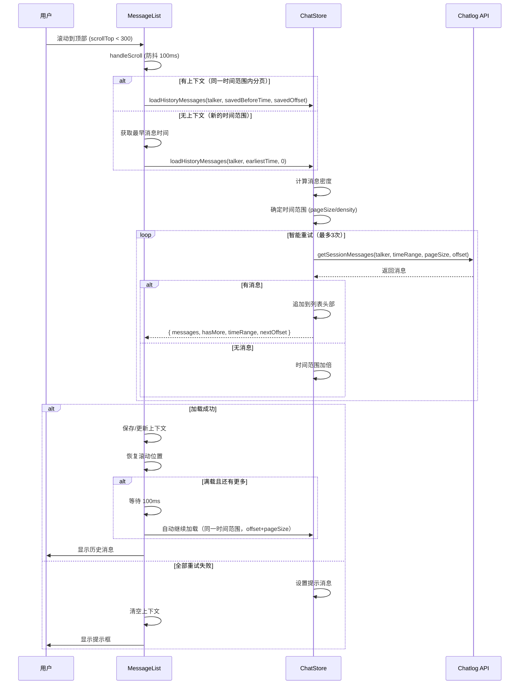

# Changelog v0.6.0 - 下拉加载历史消息功能

**版本**: v0.6.0  
**发布日期**: 2025-01-XX  
**类型**: Major Feature Release

## 📋 概述

本版本引入了全新的**下拉加载历史消息**功能，支持智能的历史消息加载、自动分页、滚动位置保持等特性，大幅提升了历史消息浏览体验。

## ✨ 核心功能

### 🎯 下拉加载历史消息

用户可以通过向上滚动或下拉到消息列表顶部，自动加载更早的历史消息，无需手动翻页。

#### 主要特性

1. **智能消息密度计算**
   - 自动分析已加载消息的时间分布
   - 根据密度动态调整加载时间范围
   - 以 pageSize 为基准，优化加载效率

2. **自动重试策略**
   - 初始加载失败时自动扩大时间范围
   - 最多重试 3 次，每次范围加倍
   - 智能提示用户当前加载状态

3. **同一时间范围内分页**
   - 使用 offset 参数在同一时间范围内分页
   - 避免跳过消息
   - 完整加载当前时间范围后再加载更早的消息

4. **滚动位置保持**
   - 加载历史消息后自动保持用户视口位置
   - 避免跳动，提供流畅的浏览体验
   - 基于 DOM 高度差计算精确调整

5. **优化的用户体验**
   - 300px 触发阈值，提前加载
   - 100ms 防抖处理，避免频繁触发
   - 清晰的加载状态指示器
   - 友好的"无消息"提示

## 🔧 技术实现

### Store 层 (`src/stores/chat.ts`)

#### 新增状态
```typescript
const loadingHistory = ref(false)        // 历史消息加载状态
const historyLoadMessage = ref('')       // 历史消息加载提示信息
```

#### 新增方法

**loadHistoryMessages()**
- 参数：
  - `talker: string` - 会话 ID
  - `beforeTime: string | number` - 最早消息时间
  - `offset: number = 0` - 偏移量
- 返回：
  ```typescript
  {
    messages: Message[],      // 加载的消息列表
    hasMore: boolean,         // 是否还有更多（在当前时间范围内）
    timeRange: string,        // 使用的时间范围
    offset: number            // 下一页的 offset
  }
  ```
- 功能：
  - 计算当前消息密度（条/天）
  - 根据密度和 pageSize 确定时间范围：`daysRange = pageSize / density`
  - 使用完整的 ISO 8601 时间格式（含时间和时区）
  - 智能加倍策略重试（最多3次）
  - 追加历史消息到列表头部

**formatDateYMD()**
- 参数：`date: Date`
- 返回：`string` (YYYY-MM-DD 格式)
- 功能：格式化日期为 API 所需格式

#### 消息密度计算

**公式**:
```
density = 消息总数 / 时间跨度（天）
daysRange = pageSize / density
```

**示例**:
- pageSize = 50
- 已加载 100 条消息，时间跨度 10 天
- density = 100 / 10 = 10 条/天
- daysRange = 50 / 10 = 5 天
- 预期加载约 50 条消息

**边界**:
- 最少 3 天
- 最多 90 天

### 组件层 (`src/components/chat/MessageList.vue`)

#### 新增状态
```typescript
const loadingHistory = ref(false)       // 历史消息加载状态
const hasMoreHistory = ref(true)        // 是否还有更多历史消息
const historyLoadMessage = ref('')      // 历史消息提示信息
const historyLoadContext = ref({        // 加载上下文
  timeRange: string,                    // 当前时间范围
  offset: number,                       // 下一页的 offset
  beforeTime: string | number           // 原始 beforeTime
})
```

#### 重构方法

**handleLoadMore()**
- 功能：加载历史消息（加载更旧的消息）
- 逻辑：
  1. 判断是否有上下文（是否在同一时间范围内分页）
  2. 有上下文：使用保存的 beforeTime 和 offset
  3. 无上下文：获取最早消息时间，offset=0
  4. 调用 Store 的 loadHistoryMessages
  5. 保存或更新上下文
  6. 如果满载，自动继续加载同一时间范围的下一页

**handleScroll()**
- 功能：处理滚动事件
- 优化：
  - 添加 100ms 防抖
  - 触发距离 300px
  - 检查加载状态避免重复触发

#### 新增 UI 元素

1. **顶部加载指示器**
   ```vue
   <div class="message-list__loading-history">
     <el-icon class="is-loading"><Loading /></el-icon>
     <span>加载历史消息中...</span>
   </div>
   ```

2. **历史消息提示框**
   ```vue
   <el-alert
     :title="historyLoadMessage"
     type="info"
     :closable="false"
     center
   />
   ```
   
   提示示例：
   - "2024-01-01T00:00:00Z 至 2024-01-15T07:13:36Z 没有消息，再次下拉尝试加载更早信息"

3. **手动加载按钮**（备用）
   ```vue
   <el-button text @click="handleLoadMore">
     加载更多历史消息
   </el-button>
   ```

### 应用状态扩展 (`src/stores/app.ts`)

#### 修改
```typescript
const loading = ref({
  app: false,
  sessions: false,
  messages: false,
  contacts: false,
  search: false,
  history: false,  // 新增
})
```

## 📊 工作流程



## 🎨 用户界面

### 加载状态流程

```
用户下拉
    ↓
显示"加载历史消息中..."
    ↓
时间范围 A: 2024-01-08T07:13:36Z~2024-01-15T07:13:36Z
    ↓
第 1 页: offset=0, 返回 50 条
保存上下文
    ↓
检测到满载 → 自动继续
    ↓
第 2 页: offset=50, 返回 30 条（未满载）
清空上下文
    ↓
显示"加载更多历史消息"
    ↓
用户继续下拉
    ↓
时间范围 B: 2024-01-01T07:13:36Z~2024-01-08T07:13:36Z
...
```

### 视觉效果

**加载中**:
- 顶部显示旋转图标 + "加载历史消息中..."
- 半透明背景，不影响现有消息阅读

**无消息提示**:
- Info 类型的 Alert 组件
- 居中显示时间范围
- 清晰说明可以继续下拉尝试

**完成状态**:
- "没有更多消息了" 分隔线（真正到达最早消息时）
- 或 "加载更多历史消息" 按钮（允许继续加载）

## 🔒 边界情况处理

### 1. 首次加载
- 无法计算密度 → 使用默认值（至少 7 天）
- 自动重试机制确保加载到消息

### 2. 网络错误
- 捕获异常，显示错误提示
- 清空上下文，允许用户重试
- 不影响已加载的消息

### 3. 已到最早消息
- 多次重试后无消息 → hasMoreHistory = false
- 显示 "没有更多消息了"
- 不再触发加载

### 4. 快速切换会话
- 重置 hasMoreHistory 为 true
- 清空 historyLoadMessage
- 清空 historyLoadContext
- 从头开始加载新会话

### 5. 空会话
- 首次加载返回空 → 显示 "暂无消息"
- 不影响历史加载功能

## 📈 性能优化

### 1. 防抖处理
- 滚动事件 100ms 防抖
- 避免频繁触发加载请求

### 2. 智能分页策略
- 基于密度计算时间范围
- 目标：每次加载约 pageSize 条消息
- 减少无效请求

### 3. DOM 优化
- 使用 nextTick 等待 DOM 更新
- 高度差算法精确恢复滚动位置
- 避免不必要的重新渲染

### 4. 网络优化
- 批量加载（pageSize）
- 同一时间范围内复用参数
- 使用完整时间格式提高精度

## 🐛 已知问题修复

### v0.6.1 修复
- ✅ hasMore 状态混淆 → 引入独立的 hasMoreHistory

### v0.6.2 修复
- ✅ pageSize 硬编码 → 使用配置的 pageSize
- ✅ 满载时未继续加载 → 自动继续加载同一时间范围

### v0.6.3 修复
- ✅ 自动加载逻辑错误 → 使用 offset 在同一时间范围内分页
- ✅ 时间格式不完整 → 使用完整的 ISO 8601 格式

### v0.6.4 修复
- ✅ hasMoreHistory 逻辑错误 → 只在真正无消息时设为 false

### v0.6.5 优化
- ✅ 密度计算改进 → 以 pageSize 为基准，目标接近但不超过 pageSize

## 📚 文档更新

### 新增文档
- `docs/features/pull-down-to-load-history.md` - 产品设计文档
- `docs/features/pull-down-to-load-history-implementation.md` - 实现说明
- `docs/examples/history-loading-example.md` - 使用示例
- `docs/QUICK_START_HISTORY_LOADING.md` - 快速开始指南
- `docs/features/IMPLEMENTATION_SUMMARY.md` - 实现总结

### 修复文档
- `docs/fixes/history-loading-hasmore-fix.md` - hasMore 状态修复
- `docs/fixes/history-loading-pagesize-fix.md` - pageSize 和自动加载
- `docs/fixes/history-loading-offset-fix.md` - offset 分页和时间格式
- `docs/fixes/history-loading-hasmore-logic-fix.md` - hasMoreHistory 逻辑
- `docs/fixes/VERIFICATION_CHECKLIST.md` - 验证清单
- `docs/fixes/SUMMARY_v0.6.2.md` - v0.6.2 总结
- `docs/fixes/FINAL_SUMMARY_v0.6.4.md` - v0.6.4 总结

## 🧪 测试建议

### 功能测试
- [ ] 基础加载：滚动到顶部触发加载
- [ ] 手动加载：点击按钮触发加载
- [ ] 首次加载就有消息
- [ ] 重试后才有消息
- [ ] 全部重试失败显示提示
- [ ] 同一时间范围内分页
- [ ] 切换到更早的时间范围

### 性能测试
- [ ] 大量消息（1000+）下的滚动流畅度
- [ ] 防抖机制有效性
- [ ] 内存占用情况
- [ ] API 请求频率

### 边界测试
- [ ] 空会话（无消息）
- [ ] 只有 1 条消息
- [ ] 消息密度极高（>100 条/天）
- [ ] 消息密度极低（<0.1 条/天）
- [ ] 网络错误处理
- [ ] 快速切换会话

## 🚀 升级指南

### 破坏性变更
无破坏性变更，向后兼容。

### 使用新功能

功能自动生效，无需额外配置。只需使用 MessageList 组件：

```vue
<template>
  <MessageList
    :session-id="currentSessionId"
    :initial-time="session?.lastTime"
    show-date
  />
</template>
```

### 配置选项

```json
{
  "pageSize": 50,           // 每次加载数量
  "enableDebug": false      // 是否启用调试日志
}
```

## ⚠️ 注意事项

### 1. 后端 API 要求
- 必须支持完整的 ISO 8601 时间格式
- 格式示例：`2024-01-08T07:13:36.000Z~2024-01-15T07:13:36.000Z`
- 需要正确处理 time 范围和 offset 参数

### 2. 时区问题
- `toISOString()` 返回 UTC 时间
- 如果需要本地时区，需要在 API 层处理

### 3. 虚拟滚动
- 当前未实现虚拟滚动
- 消息数量过多（>5000）时可能影响性能
- 计划在 v1.0.0 实现

## 🎯 成功指标

### 必须满足 ✅
- [x] 用户可以通过滚动到顶部加载历史消息
- [x] 加载历史消息时滚动位置保持不变
- [x] 根据消息密度智能调整加载范围
- [x] 失败时自动重试并显示友好提示
- [x] 有清晰的加载状态指示

### 应该满足 ✅
- [x] 支持防抖避免频繁触发
- [x] 支持手动触发加载
- [x] 提供调试日志输出
- [x] 处理网络错误情况
- [x] 文档完善清晰

### 可选满足（未来版本）
- [ ] 支持自定义配置
- [ ] 虚拟滚动优化
- [ ] 跳转到指定日期
- [ ] 单元测试覆盖

## 🔄 后续计划

### v0.7.0 (Enhancement)
- [ ] 添加请求取消机制（AbortController）
- [ ] 实现消息去重
- [ ] 支持自定义密度阈值配置
- [ ] 限制最大自动加载次数

### v1.0.0 (Major Release)
- [ ] 实现虚拟滚动
- [ ] 支持跳转到指定日期
- [ ] 添加历史消息缓存策略
- [ ] 完整的单元测试覆盖（> 80%）

## 💡 使用示例

### 基础使用

```vue
<template>
  <MessageList
    :session-id="currentSessionId"
    :initial-time="session?.lastTime"
    show-date
  />
</template>
```

### 访问状态

```typescript
import { useChatStore } from '@/stores/chat'

const chatStore = useChatStore()

// 检查是否正在加载
console.log(chatStore.loadingHistory)

// 获取提示消息
console.log(chatStore.historyLoadMessage)
```

### 手动触发

```typescript
const result = await chatStore.loadHistoryMessages(
  'user123',
  '2024-01-15T07:13:36Z',
  0
)
console.log(`加载了 ${result.messages.length} 条消息`)
```

## 📞 反馈

如有问题或建议，请通过以下方式反馈：
- GitHub Issues
- 项目讨论区

---

**版本状态**: ✅ Released  
**发布日期**: 2025-01-XX  
**下一个版本**: v0.7.0 (计划中)